# Local Development Setup - Linux

## Overview

- **This guide assumes you are on linux.** [Windows](dev-windows.md) and [Mac](dev-mac.md) will have different setup methods.
- **Please read every step of this guide carefully.** It is highly recommend doing a full read-through before you even get started. This guide is meant to be beginner friendly, HOWEVER, be aware linux can be a bit of a beast if you are not familiar with it. Be patient and **do not skip steps**.

Within this guide, we will be setting up your copy of lorekeeper code as well as installing and configuring the following software:

- [PHP](https://www.php.net/)
- [Composer](https://getcomposer.org/)
- [Mariadb](https://mariadb.org/)
- [dbeaver](https://dbeaver.com/) (DB Management Software)

!!! info "Replace the <text\> with your own info"
    For the purposes of this guide, when you need to fill in your own text it will be enclosed in angle brackets: `<Explaination Text>`.

    For example, if the guide gives the command `cd <Your Lorekeeper Directory> ` and your lorekeeper directory was in ~/Documents/lorekeeper, you would type `cd ~/Documents/lorekeeper` in your terminal window.

## Lorekeeper Codebase Setup

We are now going to use SourceGit to make a clone of Lorekeeper. This will be your personalized version that is eventually posted to your live website.

### Cloning Lorekeeper

In SourceGit, select the little cloud icon in the top right to "Clone Repository." "Clone" is the Git term for making a copy of the code.
<figure markdown="span">
  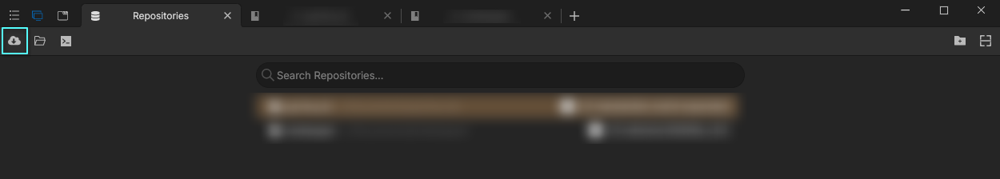{ width="600" }
</figure>

Now fill out the information that tells SourceGit where the Lorekeeper code is located. In the browser, it can be accessed [here](https://github.com/lk-arpg/lorekeeper), but we use a slightly different URL address when pasting it into Git which can be found on the github page.
<figure markdown="span">
  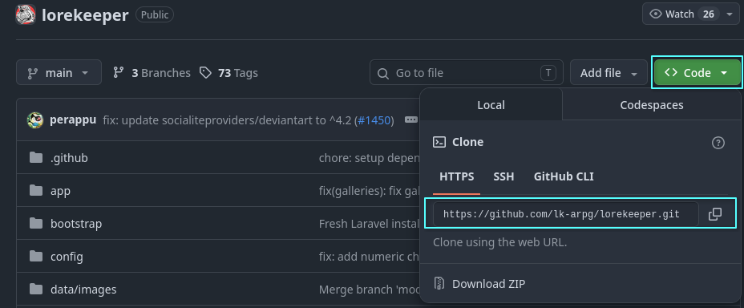{ width="600" }
</figure>

Fill in the missing info:

  - For **Repository URL**, paste in `https://github.com/lk-arpg/lorekeeper.git`
  - For **Parent Folder**, this will define where the code exists on your computer and can be anywhere.
  - Everything else can be left blank.

<figure markdown="span">
  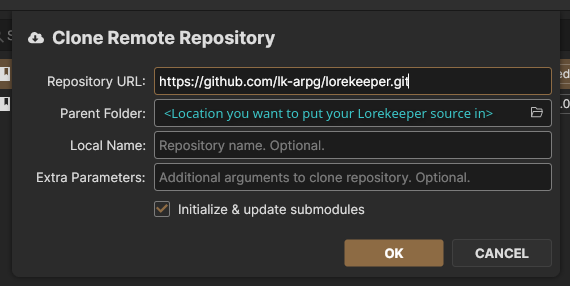{ width="600" }
</figure>

Click "OK" to beginning cloning the repo. When this is done you will have a local copy of lorekeeper which you're almost ready to start using!

### Changing Lorekeeper Remote

Now that we have a local lorekeeper, we need to change the remote location of the clone so you can begin tracking changes to your unique lorekeeper and pulling in extensions from other places.

#### Rename Current Origin
The first thing you will want to do is rename the origin (core Lorekeeper) remote so that later you can add a new origin for your code to be checked in (sent back) to.

Click the dropdown for "Remotes", and then right click "origin" and click "Edit".
<figure markdown="span">
  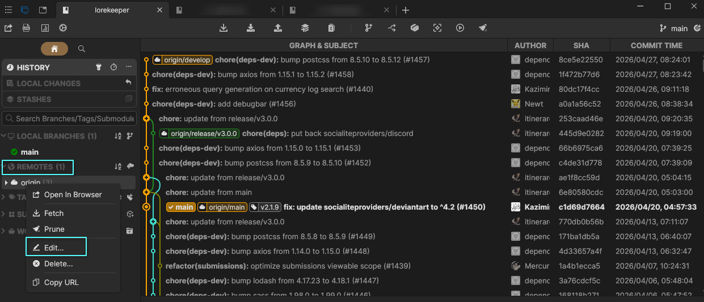{ width="600" }
</figure>

Rename this branch to something to indicate to you that this is where the core lorekeeper updates will come from.
<figure markdown="span">
  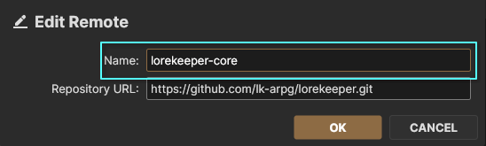{ width="600" }
</figure>

Click "OK" and now you should see the newly renamed core lorekeeper:
<figure markdown="span">
  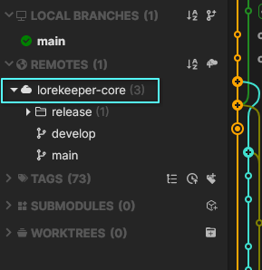{ width="600" }
</figure>

*Note: You may notice this remote has more than one branch. At the time of writing this, the main branch is v2.1. This means in order to start with v3.0 (which these docs are written for)
you will want to merge `release/v3.0.0` in to your current local branch.*

**Please note that is *extremely discouraged* to put your site on the develop branch of Lorekeeper, especially if you have no prior knowledge.** Please see our [dev intro](../dev-intro.md#navigating-branches) regarding different branches.

!!! info "Cloning a Higher Version of LK"
    If you wish to update to version 3.0 or otherwise, simply pull that branch into your local branch with **right click** -> **"Merge into main"**.

    <figure markdown="span">
      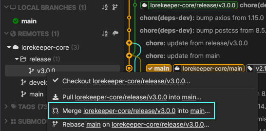{ width="600" }
    </figure>
    <figure markdown="span">
      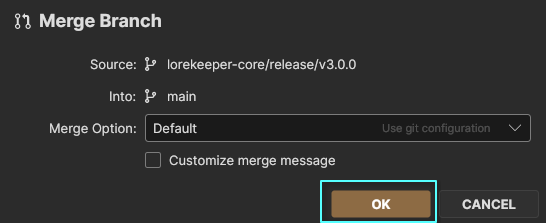{ width="600" }
    </figure>

Congrats, now we have a local version of lorekeeper and can move on to setting up our local testing environment!

## Local Testing Setup
Now that we have our codebase, we need to install just a few more pieces of software before we can get our copy of Lorekeeper fully up and running.

### PHP
Lorekeeper v3.0 requires PHP 8.3 (php-legacy). If you have need for a different version of php, use this script to handle installing php versions from AUR (`https://github.com/Its-Satyajit/phpv`) and follow the instructions given there instead of the PHP section here.

Install PHP
: `sudo pacman -S php-legacy`

Install PHP-GD
: `sudo pacman -S gd php-gd`

### Mariadb
Install mariadb
: `sudo pacman -S mariadb`

Configure mariadb
: `mariadb-install-db --user=mysql --basedir=/usr --datadir=/var/lib/mysql`

Start Mariadb
: `sudo systemctl start mariadb`

: *(Optional) Configure Mariabd service to start automatically on system startup using the command `sudo systemctl enable mariadb`. Otherwise, you will have to start it manually by running the command above whenever you want to access your lorekeeper for testing purposes:*

Edit `/etc/php/php.ini` to enable the following extensions:
: `sudo nano /etc/php/php.ini`

- curl
- iconv
- mysqli
- pdo_mysql
- zip

The php.ini file's Dynamic Extensions section should look like this:
<figure markdown="span">
  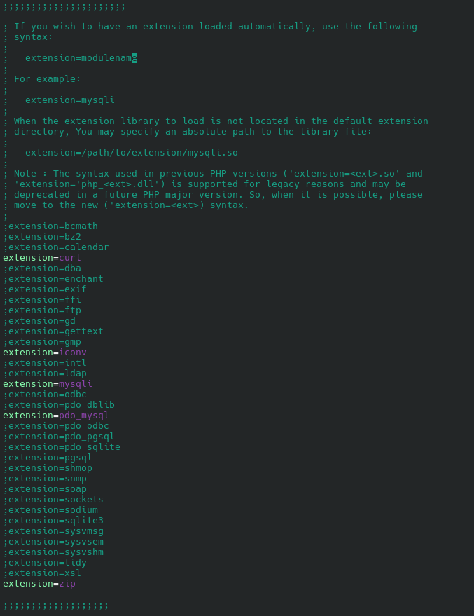{ width="600" }
</figure>

### Dbeaver
Install Dbeaver
: `sudo pacman -S dbeaver`

Now you should be able to launch Dbeaver.
Once launched, click the **Database** tab and select **MariaDB** then **Next**
<figure markdown="span">
  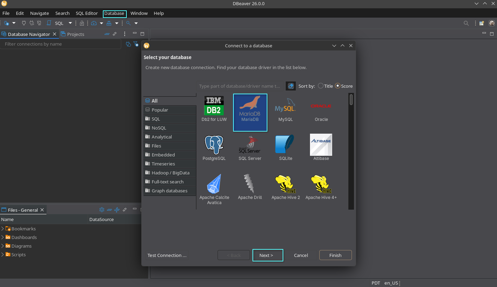{ width="600" }
</figure>

Enter **“test”** as your DB. **By default the root user will have no password** and you can leave this blank, but if you have set a root password for your mariadb database enter that here too.
<figure markdown="span">
  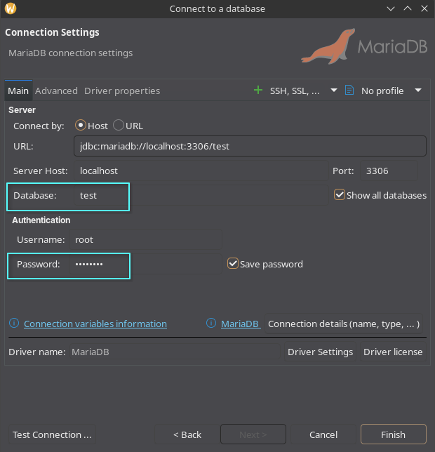{ width="600" }
</figure>
You can click the **Test Connection** button to verify DBeaver is able to connect to the DB.
Then click **Finish**

Your Dbeaver should then display the test database space.
To add a database for your lorekeeper, right click **Databases** in the left window and click **"Create new Database"**
<figure markdown="span">
  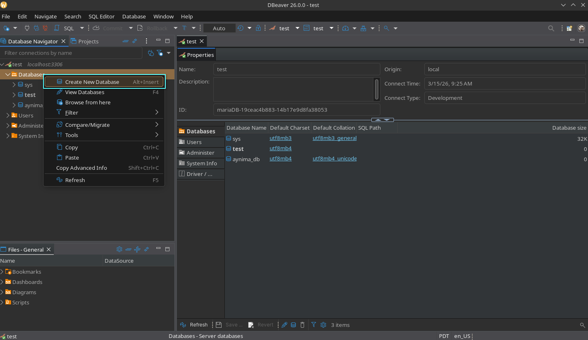{ width="600" }
</figure>
Follow prompts to create your database. Remember the name for later.

### Composer
Install Composer
: `sudo pacman -S composer`

Then, **reboot your computer.** While Composer mentions that it won't always be necessary, rebooting your computer after installing Composer is the best way to prevent issues.

Open a terminal again and cd to your lorekeeper directory. Then, run the following command:
: `composer install`

This will take some time to complete, be patient as it installs.

After installation has completed, create a file in your Lorekeeper directory with the name `.env` and copy the following in to it, changing the **DB_DATABASE** to the name of the database you created in the previous section and setting the **DB_PASSWORD** if you set one:

```
APP_NAME=Lorekeeper
APP_ENV=local
APP_KEY=
APP_DEBUG=true
APP_URL=http://localhost

CONTACT_ADDRESS=
DEVIANTART_ACCOUNT=

LOG_CHANNEL=stack
DB_CONNECTION=mysql
DB_HOST=127.0.0.1
DB_PORT=3306
DB_DATABASE=<change to your database name! no spaces>
DB_USERNAME=root
DB_PASSWORD=

BROADCAST_DRIVER=log
CACHE_DRIVER=file
QUEUE_CONNECTION=sync
SESSION_DRIVER=file
SESSION_LIFETIME=120

REDIS_HOST=127.0.0.1
REDIS_PASSWORD=null
REDIS_PORT=6379

MAIL_DRIVER=
MAIL_HOST=
MAIL_PORT=587
MAIL_USERNAME=
MAIL_PASSWORD=
MAIL_FROM_ADDRESS=
MAIL_FROM_NAME=

AWS_ACCESS_KEY_ID=
AWS_SECRET_ACCESS_KEY=
AWS_DEFAULT_REGION=
AWS_BUCKET=

PUSHER_APP_ID=
PUSHER_APP_KEY=
PUSHER_APP_SECRET=
PUSHER_APP_CLUSTER=
MIX_PUSHER_APP_KEY="${PUSHER_APP_KEY}"
MIX_PUSHER_APP_CLUSTER="${PUSHER_APP_CLUSTER}"
```

Once done, run the following commands in your terminal ensuring you are in your Lorekeeper directory:

Note: *Your .env file MUST be set up for these to work.*

: `php artisan key:generate`
: `php artisan migrate`
: `php artisan add-site-settings`
: `php artisan add-text-pages`
: `php artisan copy-default-images`
: `php artisan setup-admin-user`

As of v2.0.0, when you run the `setup-admin-user` command in a local environment, it will ask you if you wish to enter an alias (a deviantArt username by default). This does not need to be a real account and you will be able to “verify” it and your email address through the script. However, adding subsequent users must still be manually verified in the database.

You are now ready to access your local lorekeeper through:
: `php artisan serve`

And connecting to `http://localhost:8000` on the browser

## Setup Complete

You have finished installing a local copy of Lorekeeper. You can login as the admin account you just set up, and begin trying out the different features.

<figure markdown="span">
  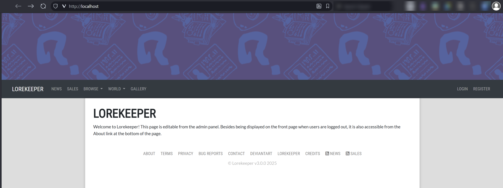{ width="600" }
</figure>

When you are ready, you can move onto [configuring your github remote](../setup-index.md#github-set-up).