# Local Setup - Windows

## Installing XAMPP

1. Download [XAMPP](https://www.apachefriends.org/download.html).

  - For LK v2, select **PHP 8.1**.
  - For LK v3.0 or above, select **PHP 8.2**.

<figure markdown="span">
  { width="600" }
</figure>

2. Run the XAMPP .exe file. **If you see this warning, as long as you follow this guide, you can ignore it.**

<figure markdown="span">
  { width="600" }
</figure>

3. Click the "Next" button. You will then see this screen. We just want the defaults -- click "Next" again.

<figure markdown="span">
  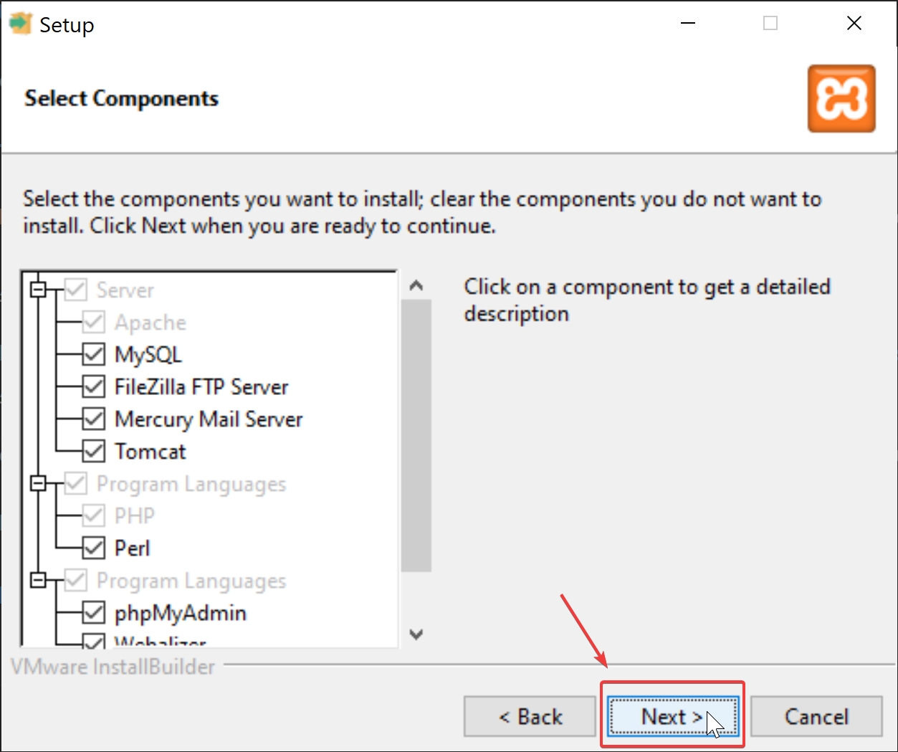{ width="600" }
</figure>

4. Install XAMPP directly onto your C: drive. A good location is `C:\xampp`, which should also be the default. Then, click "Next".

<figure markdown="span">
  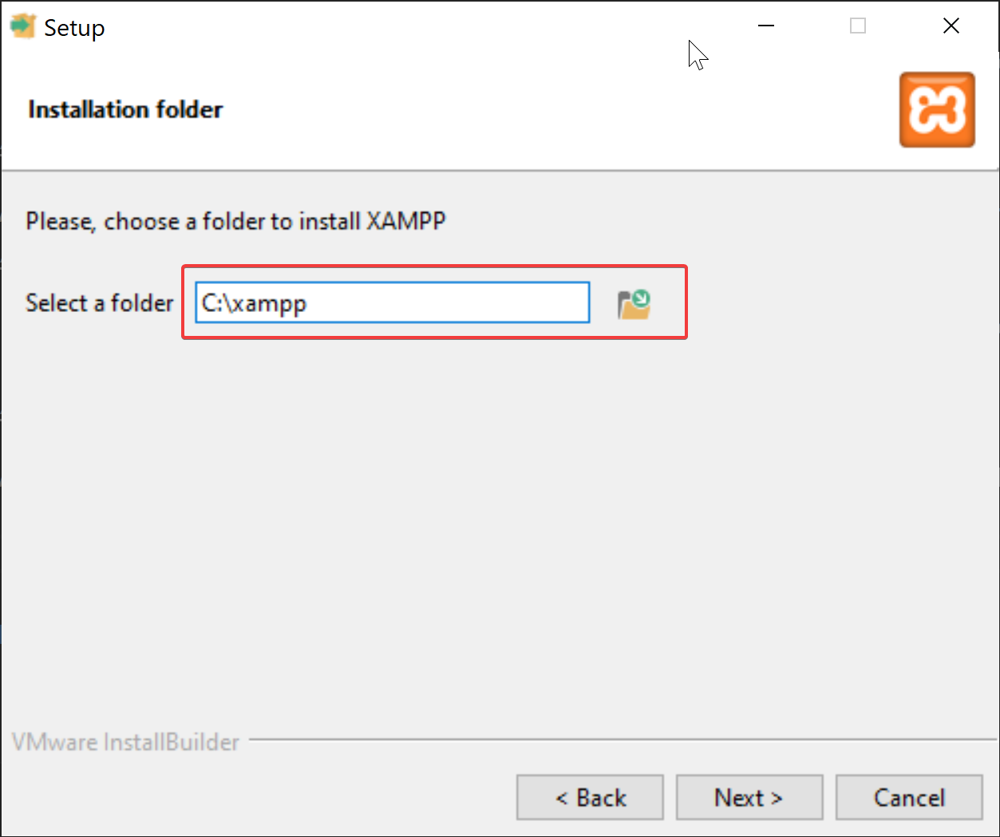{ width="600" }
</figure>

5. Select your preferred language. This doesn't matter -- pick what's best for you.

<figure markdown="span">
  { width="600" }
</figure>

6. Click "Next" on the following screen. 

<figure markdown="span">
  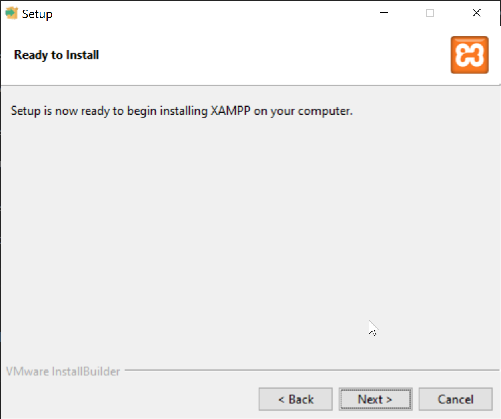{ width="600" }
</figure>

7. XAMPP should now begin to install. This may take some time -- be patient!

<figure markdown="span">
  { width="600" }
</figure>

8. Once XAMPP has installed, check the box to start the control panel immediately (if it is not checked by default).

<figure markdown="span">
  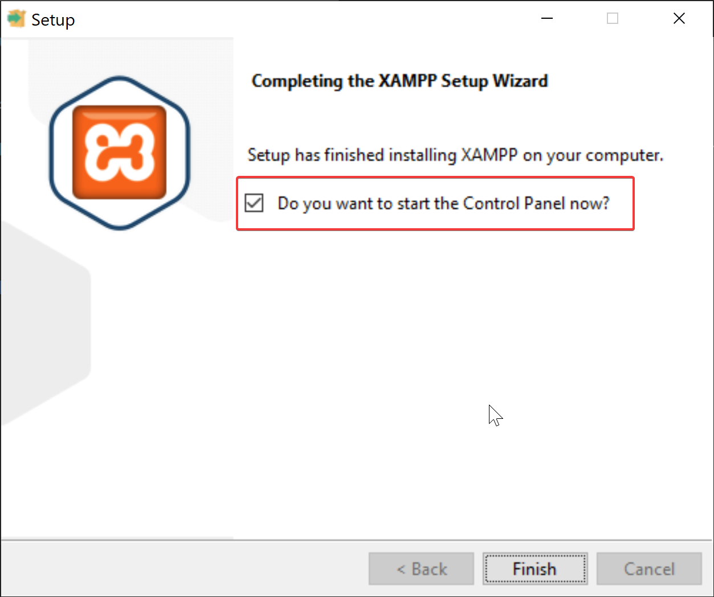{ width="600" }
</figure>

9. Congrats! You now have XAMPP installed. Click "Start" next to Apache and MySQL.

<figure markdown="span">
  { width="600" }
</figure>

**If you are presented with a window like this for either application: Check both "Private" and "Public", then click "Allow Access". This software is perfectly safe.**

<figure markdown="span">
  { width="600" }
</figure>

10. Next, we need to update the config files. Click "Config" next to Apache, and select `php.ini`.

<figure markdown="span">
  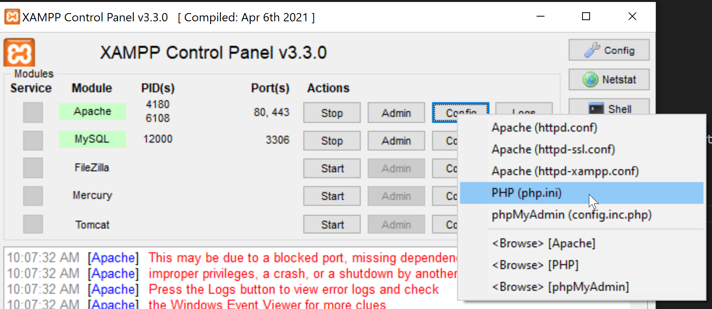{ width="600" }
</figure>

10. A file should open up in Notepad. We are going to change two values. First, use the search feature (Ctrl + F) or simply scroll down until you see `post_max_size`. This controls how large the files are that you can upload. Change this to `0` on your local *only*.

<figure markdown="span">
  { width="600" }
</figure>

11. The next value we change is `upload_max_size`. I like to change this to abnormally high on my local, but make it whatever feels right for you. To change it to 10 megabytes, for example, put a value of `10M`.

<figure markdown="span">
  { width="600" }
</figure>

12. Close this file and save your changes. We are going to edit one more config file.

13. Go back to XAMPP, click "Config", and select `http.conf`.

<figure markdown="span">
  { width="600" }
</figure>

14. Another file should open up in Notepad. We are going to change one value this time. Change whatever value is currently in `DocumentRoot` and the following `Directory` line to `C:\xampp\htdocs\lorekeeper\public`.

<figure markdown="span">
  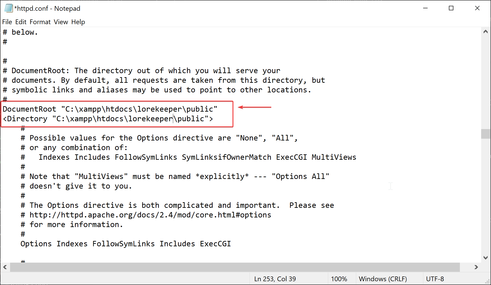{ width="600" }
</figure>

15. Close this file and save your changes. Then, click the "Stop" button next to Apache. After it **fully shuts downs**, click "Start" again.

<figure markdown="span">
  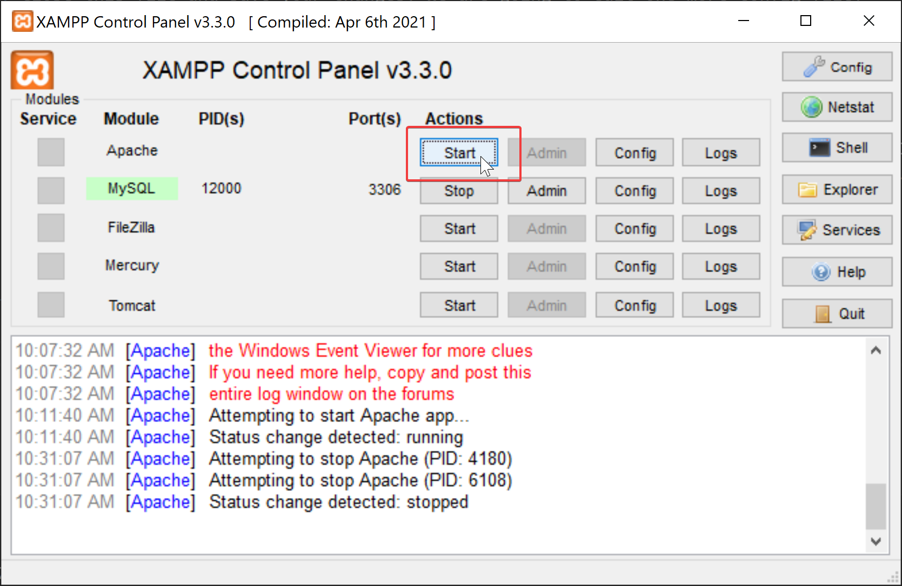{ width="600" }
</figure>

16. Next, we are going to make one more change in anticipation of installing Lorekeeper. Click the "Admin" button next to MySQL.

<figure markdown="span">
  { width="600" }
</figure>

17. This will open a window similar to this in your browser. This is PHPMyAdmin, and it is where we control how most of the data is stored for Lorekeeper. Click "New".

<figure markdown="span">
  { width="600" }
</figure>

18. Type in `lorekeeper` or any other easy to remember name, then click "Create".

<figure markdown="span">
  { width="600" }
</figure>

19. **Congratulations! We're done here for now.** Next, we will install the Git software needed to manage our Lorekeeper files.

## Installing Git Software

Historically, the software used for managing Git was Sourcetree, but I will be using **Git Extensions** as it is more stable and frequently updated.

### Installing Git

1. First, we need to install Git itself. Git is a tool used to manage files and file history for coding projects. Go [here](https://git-scm.com/downloads) to download the latest copy of Git.

Click this button...
<figure markdown="span">
  { width="600" }
</figure>

..and then this link.
<figure markdown="span">
  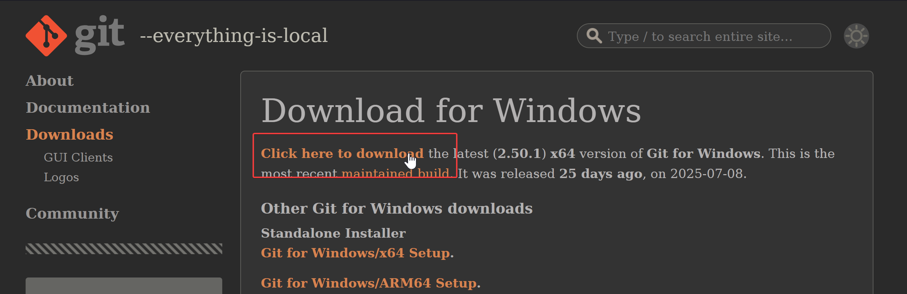{ width="600" }
</figure>

2. After the file is done downloading, run it. You will see this screen. Press "Next".

<figure markdown="span">
  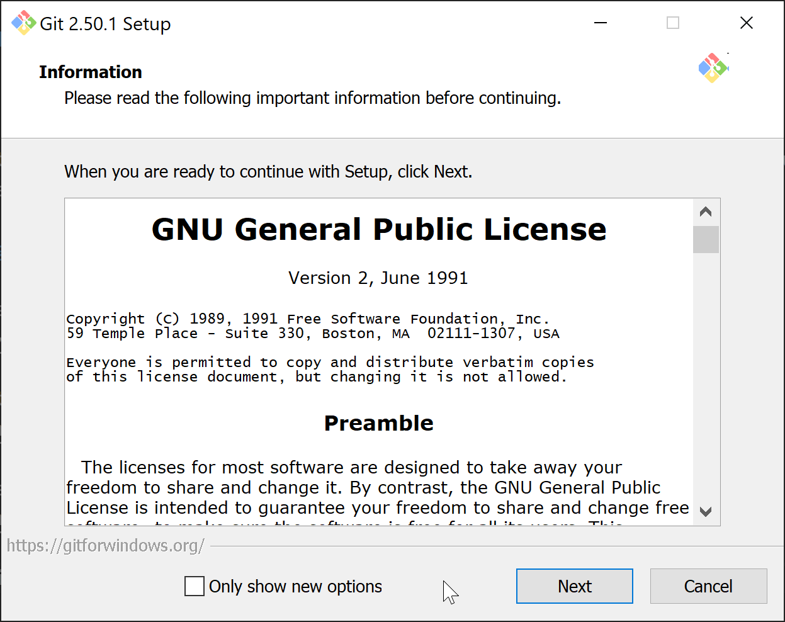{ width="600" }
</figure>

3. **Make sure the highlighted fields are selected.** Press "Next".

<figure markdown="span">
  { width="600" }
</figure>

4. This next option is up to you. I personally use Notepad++, but if you're brand new, select **Notepad**.

<figure markdown="span">
  { width="600" }
</figure>

5. This next option should populate by default, but for maximum compatibility with Lorekeeper, you will want to make sure you check "Override" and type in `main`.

<figure markdown="span">
  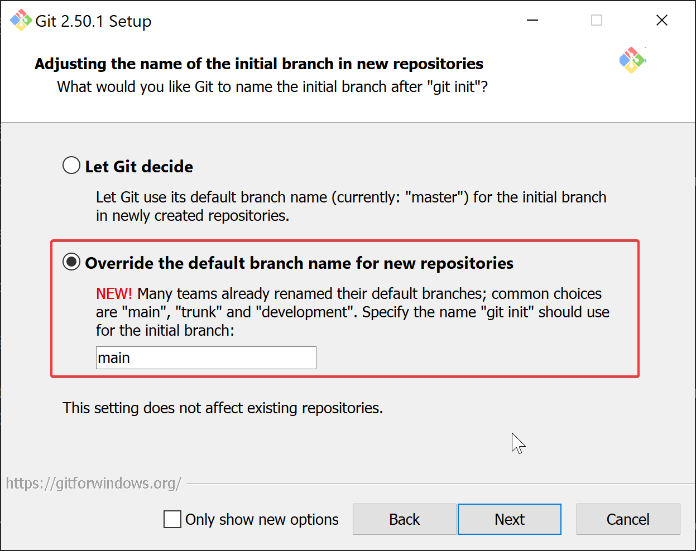{ width="600" }
</figure>

6. You will then see this screen. Select the middle/"recommended" option.

<figure markdown="span">
  { width="600" }
</figure>

7. The default (OpenSSH) on this screen is fine.

<figure markdown="span">
  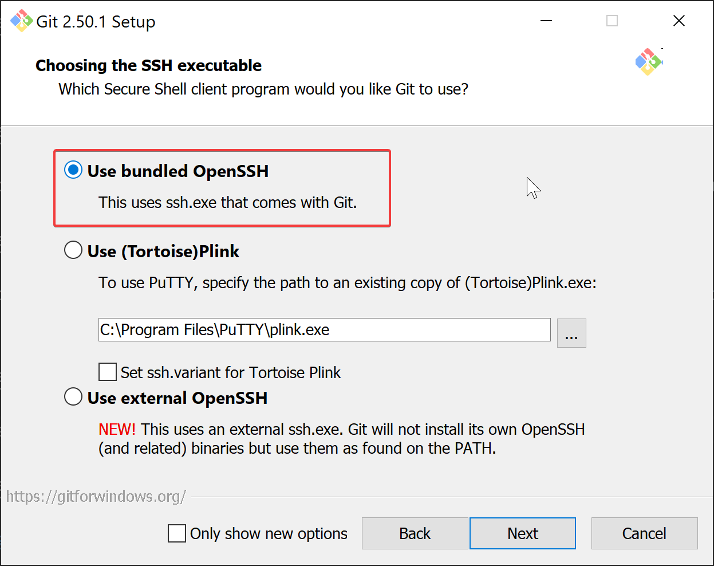{ width="600" }
</figure>

8. Leave this option (OpenSSL) also as default.

<figure markdown="span">
  { width="600" }
</figure>

9. Select the default (Checkout Windows-style, commit Unix-style line endings) here as well.

<figure markdown="span">
  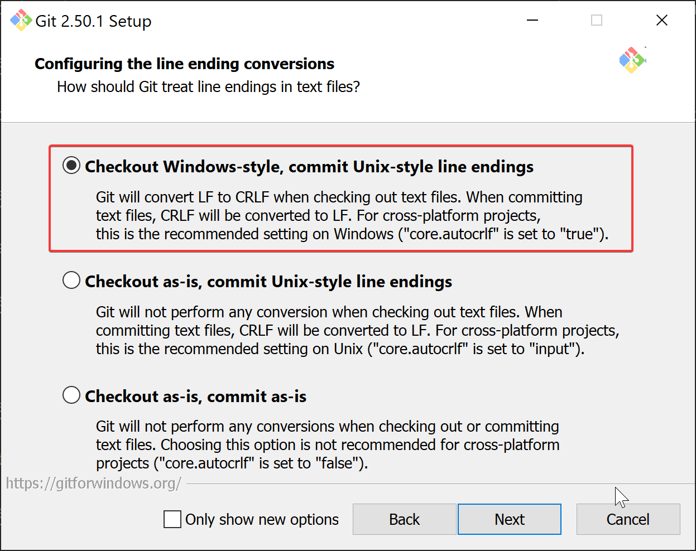{ width="600" }
</figure>

10. You know the drill -- select the default (MinTTY)!

<figure markdown="span">
  { width="600" }
</figure>

11. **This one is important. Select "fast-forward or merge".**

<figure markdown="span">
  { width="600" }
</figure>

12. The default is good here as well.

<figure markdown="span">
  { width="600" }
</figure>

13. Check both these options.

<figure markdown="span">
  { width="600" }
</figure>

14. You may be prompted with this screen. If so, **close all other windows on your computer** and then click "Install".

<figure markdown="span">
  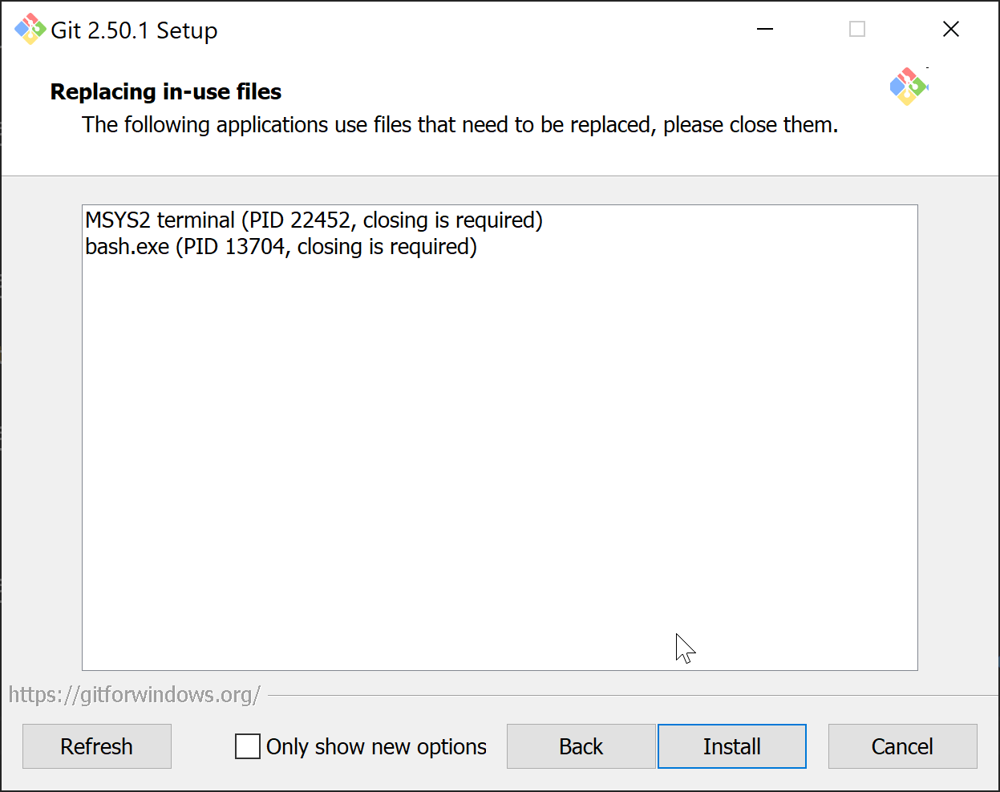{ width="600" }
</figure>

15. Git will then begin to install. Be patient while it completes!

<figure markdown="span">
  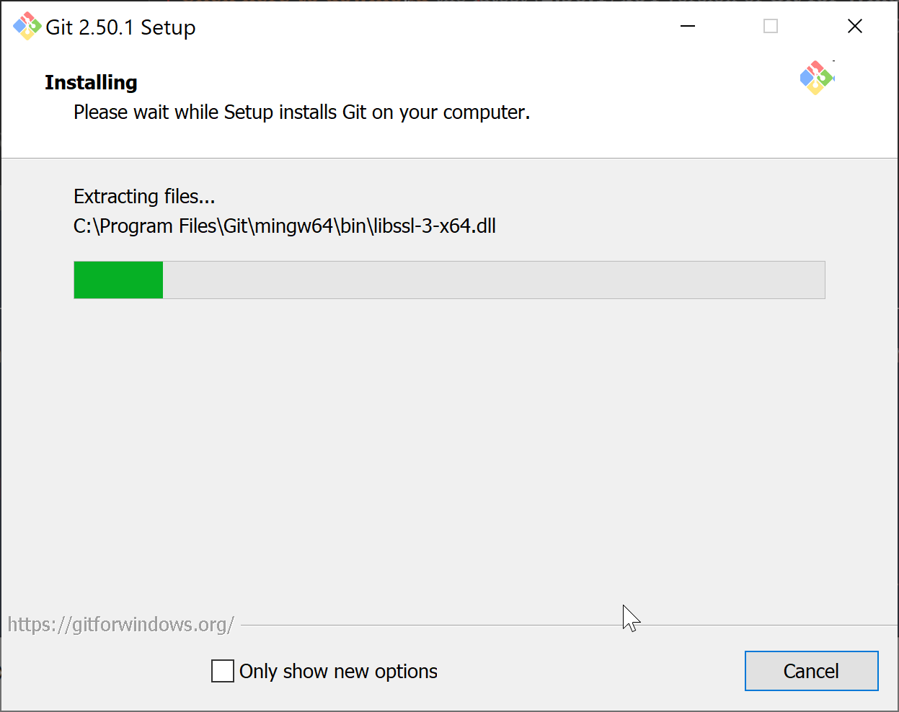{ width="600" }
</figure>

16. Congratulations! Git is now installed. Check "finish".

<figure markdown="span">
  { width="600" }
</figure>

17. **Reboot your entire computer.** Certain things we installed with Git will only take effect _after_ our computer has restarted. So do that, and then come back!

### Installing Git Extensions

You can use Git purely from the command line, but it's not reccomended for beginners. To make things easier, we will be using a tool called **Git Extensions**.

1. Go [here](https://gitextensions.github.io) and click "Download". 

<figure markdown="span">
  { width="600" }
</figure>

2. Scroll down and download the `.msi` file.

<figure markdown="span">
  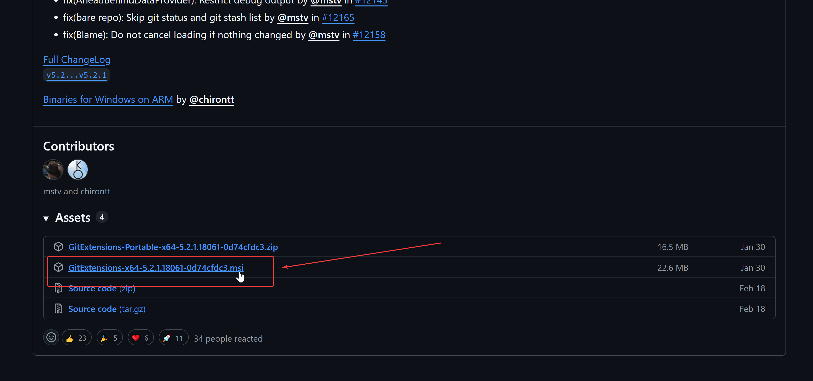{ width="600" }
</figure>

3. Run this file. You should be prompted with a window like this. Click "Next".

<figure markdown="span">
  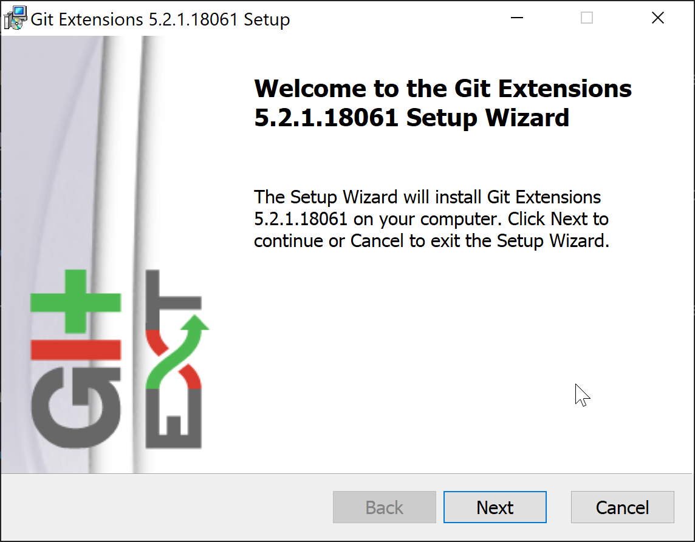{ width="600" }
</figure>

4. You will be presented with two options. Select "Install for all users of this machine".

<figure markdown="span">
  { width="600" }
</figure>

5. Then, you will be asked for the installation directory. The default is perfectly acceptable.

<figure markdown="span">
  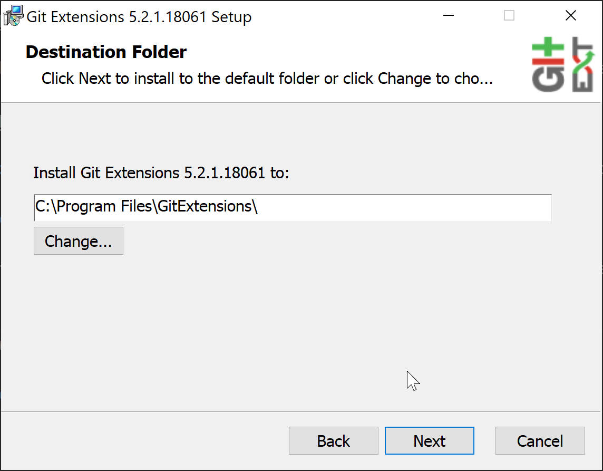{ width="600" }
</figure>

6. Click "Next" on this screen. We don't need to change any of the options.

<figure markdown="span">
  { width="600" }
</figure>

7. Git Extensions will then begin installing. After it's done, you'll be sent to this screen. Click "Finish".

<figure markdown="span">
  { width="600" }
</figure>

8. When starting Git Extensions, you may see this message. That's OK! We just need to install one more file. 

<figure markdown="span">
  { width="600" }
</figure>

Click the button. It should open a webpage and automatic start the download of the .NET runtime. Run this file, and install it. It's a fairly straightforward install -- you shouldn't be presented with any funky options.

<figure markdown="span">
  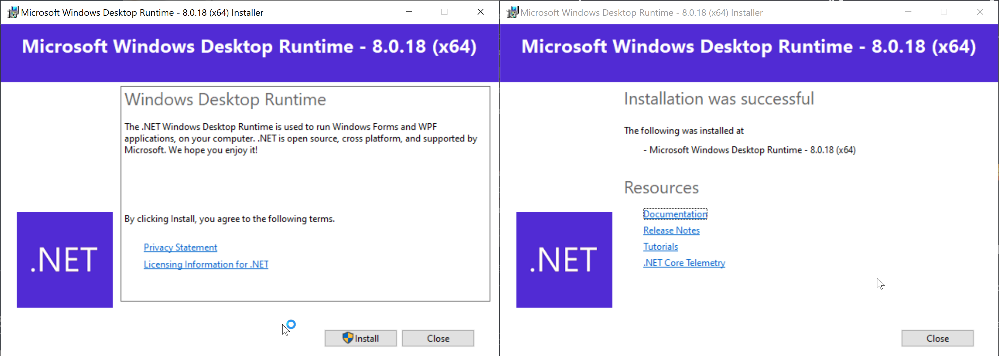{ width="600" }
</figure>

9. Start Git Extensions again. You should be presented with the option to pick your language. I will be selecting English.

<figure markdown="span">
  { width="600" }
</figure>

10. Git Extensions will present you with this "checklist" window every time you start the software. **Not everything needs to be completed for it to run properly -- we will go through the essentials.**

<figure markdown="span">
  { width="600" }
</figure>

11. Most options should be automatically marked as green. Please make a thread in the Lorekeeper discord if any of the options are not automatically detected. The option we are most concerned about is the second (configuring a username/email), which may or may not be green for you. Click that option.

<figure markdown="span">
  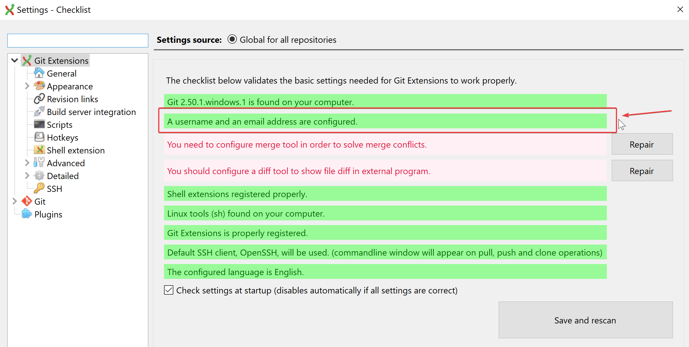{ width="600" }
</figure>

12. **Make sure the highlighted values are something you are OK with being seen by the public.** They are mandatory fields. All others can be left blank. Fill them in how you'd like, then select **Apply** then **OK**.

<figure markdown="span">
  { width="600" }
</figure>

13. A window like this should then open. **Congratulations! Git Extensions is now installed.**

<figure markdown="span">
  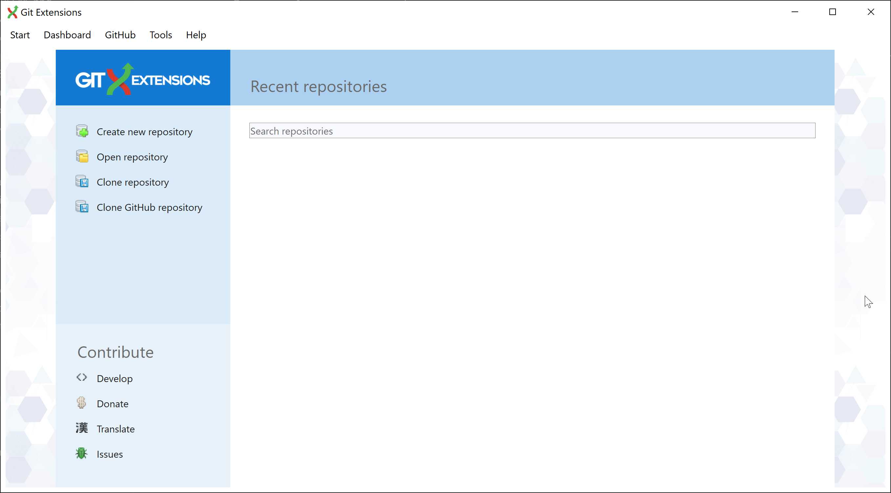{ width="600" }
</figure>

## Copying Lorekeeper

Now we start to get to the fun stuff! We are now going to use Git Extensions to make a copy of Lorekeeper. This will be your personalized version that is posted to your live website.

1. In Git Extensions, select "Clone a Repository." "Clone" is the Git term for making a copy of the code.
(Ignore the button that says to specifically clone a GitHub Repository. That option is for advanced users who have GitHub accounts.) 

<figure markdown="span">
  { width="600" }
</figure>

2. Now we will fill out this field with some information that tells Git Extensions where the Lorekeeper code is located. On the browser, it can be access [here](https://github.com/lk-arpg/lorekeeper), but we use a slightly different URL address when pasting it into Git.

3. Paste `https://github.com/lk-arpg/lorekeeper.git` into the first text box labeled **Repository to clone**. Some data will begin to populate automatically -- that's good!

<figure markdown="span">
  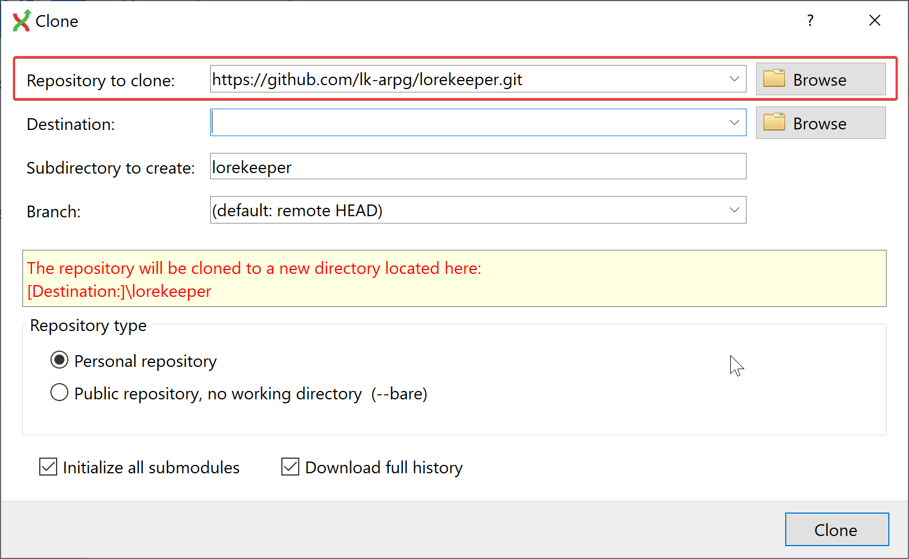{ width="600" }
</figure>

4. Next, click "Browse". We are going to navigate to a specific directory within our installation of XAMPP. If you installed XAMPP in the directory `C:/xampp/`, we will be selecting the folder `C:/xampp/htdocs`.

<figure markdown="span">
  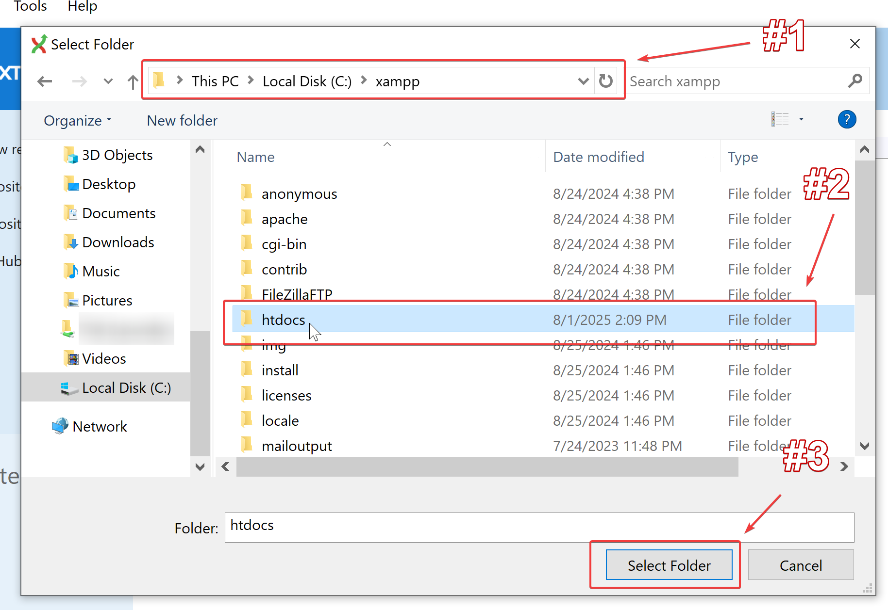{ width="600" }
</figure>

5. After clicking "Select Folder", your window should look like this.

<figure markdown="span">
  { width="600" }
</figure>

6. Click the dropdown next to "Branch" and select `main`. You also have to option to directly select the 3.0.0 version, but this can make things slightly more complicated later on. We will instead download LK v2 (aka `main`) and then update it to match v3.

<figure markdown="span">
  { width="600" }
</figure>

7. After that's selected, leave everything else as default. You can then click "Clone".

<figure markdown="span">
  { width="600" }
</figure>

8. A window like this will show up. Let it do its thing, then click "OK" when prompted.

<figure markdown="span">
  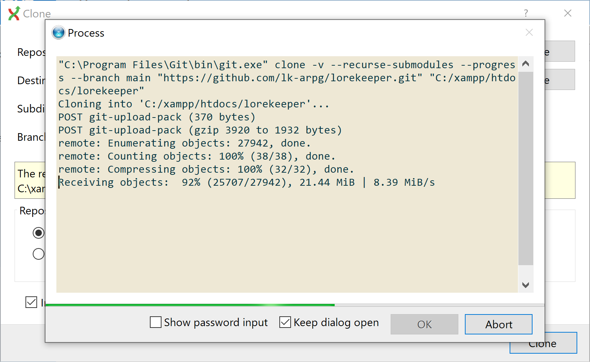{ width="600" }
</figure>

9. Click "Yes" to open the new repository now.

<figure markdown="span">
  { width="600" }
</figure>

10. It will open a screen like this. There's a lot of buttons here, but don't fret! We won't need most of them.

<figure markdown="span">
  { width="600" }
</figure>

11. First, let's make sure we're updated to v3.0.0. On the left panel you'll see a dropdown labeled `origin`. Click that to create a further dropdown, then click `release`. You will see a branch labeled v3.0.0. A "branch" refers to a specific version of the code.

<figure markdown="span">
  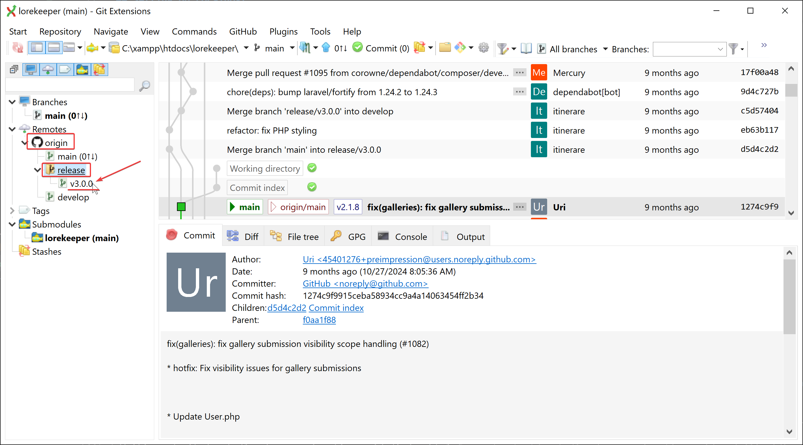{ width="600" }
</figure>

12. Right-click 'v3.0.0' and select "Fetch & Merge (Pull)".

<figure markdown="span">
  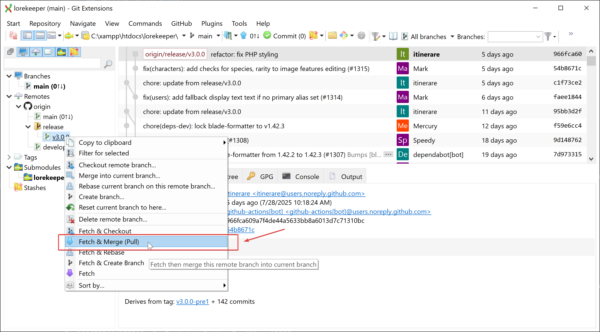{ width="600" }
</figure>

13. You will see a similar window to before -- get used to it, this is what will be displayed every time you perform a git operation! Press "OK" when prompted.

<figure markdown="span">
  { width="600" }
</figure>

14. This window will then appear. Leave everything as default, and select "Merge".

<figure markdown="span">
  { width="600" }
</figure>

15. Press "OK" after this window finishes processing.

<figure markdown="span">
  { width="600" }
</figure>

16. That's it! You now have a copy of Lorekeeper on your computer, updated to v3.0.0.

## Setting Up Lorekeeper

Back to installing stuff. There's a few things we need before we can full get our copy of Lorekeeper up and running.

### Installing Composer

1. We need to install two more pieces of software. First, we will install Composer. Go [here](https://getcomposer.org) and select "Download" beneath the image of this funky little dude.

<figure markdown="span">
  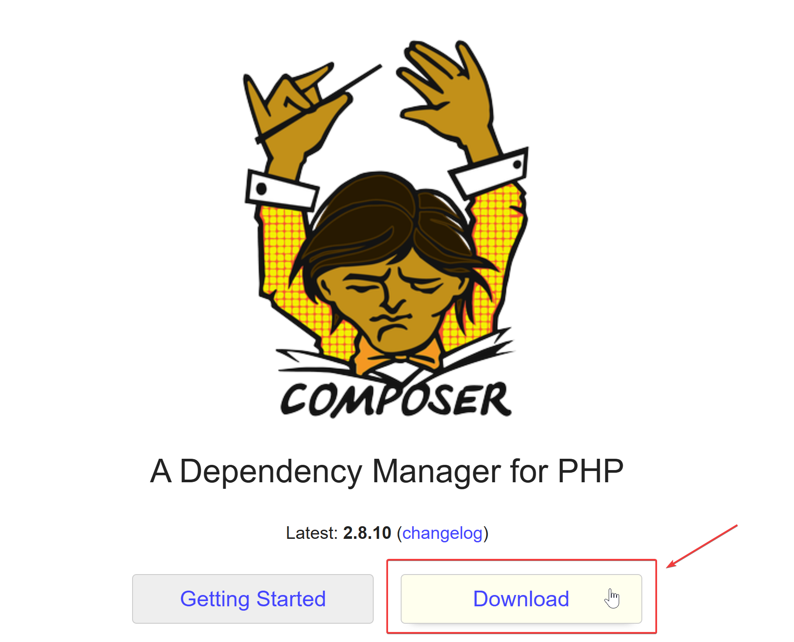{ width="600" }
</figure>

2. Click the link for the Windows Installer, then run it.

<figure markdown="span">
  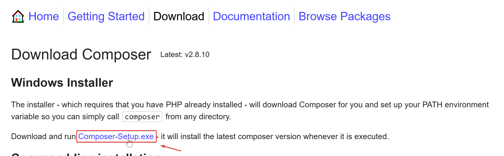{ width="600" }
</figure>

3. Click to install for all users.

<figure markdown="span">
  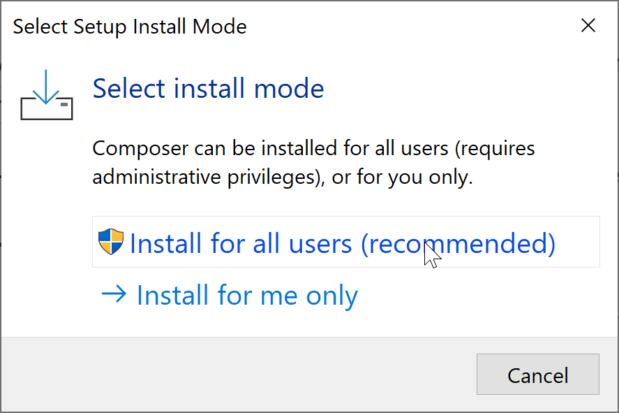{ width="600" }
</figure>

4. Leave developer mode **unchecked**. Click "Next".

<figure markdown="span">
  { width="600" }
</figure>

5. XAMPP should be automatically selected as your command line version of PHP. If not, use the dropdown to select it. If prompted, also select the checkmark to add it to your path.

<figure markdown="span">
  { width="600" }
</figure>

6. Click "Next" on this screen.

<figure markdown="span">
  { width="600" }
</figure>

7. You will see a screen similar to this one, summarizing your options. Click "Install".

<figure markdown="span">
  { width="600" }
</figure>

8. On this screen, click "Next".

<figure markdown="span">
  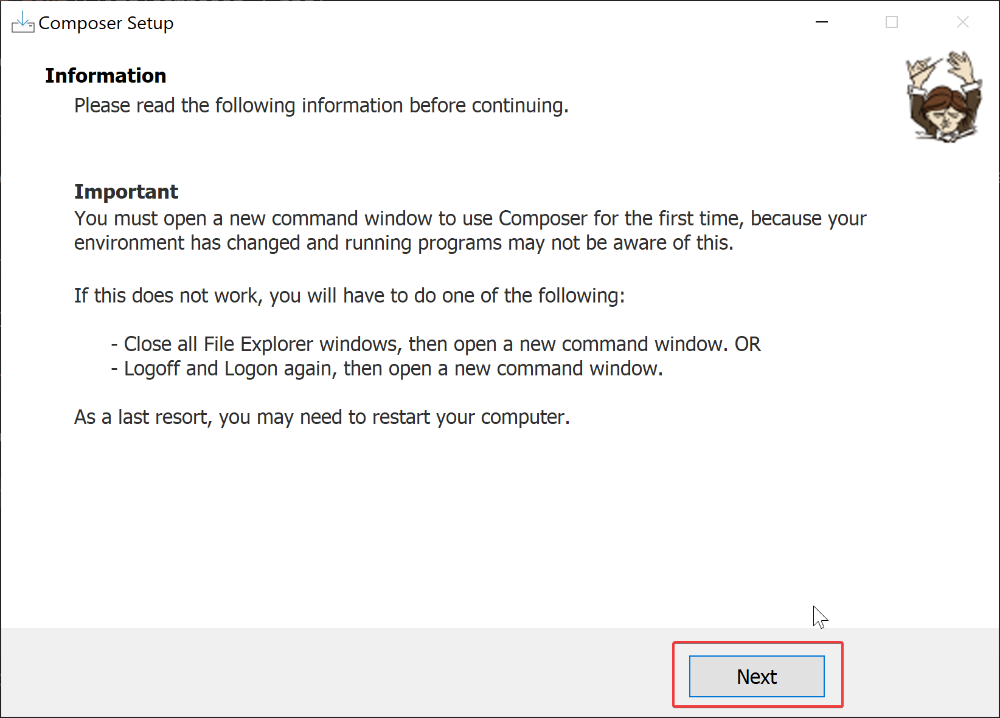{ width="600" }
</figure>

9. Then, click "Finish"!

<figure markdown="span">
  { width="600" }
</figure>

10. **Reboot your computer.** While Composer mentions that it won't always be necessary, rebooting our computer after installing Composer is the best way to prevent issues.

### Installing Visual Studio Code

Visual Studio Code is the piece of software we will use to edit our Lorekeeper files. (Pardon the sparse screenshots here, I already had it installed!)

**A Note for Advanced Users:** You can install the VSCodium open source version, which comes with AI/Copilot features disabled by default, [here](https://github.com/VSCodium/vscodium/releases). However, you may run into issues with using certain extensions due to Microsoft's licensing. When in doubt, it is better to go with the Microsoft official release.

1. Go [here](https://code.visualstudio.com) to download it and press the big download button. (Fortunately, we can disable the recently added AI features.)

<figure markdown="span">
  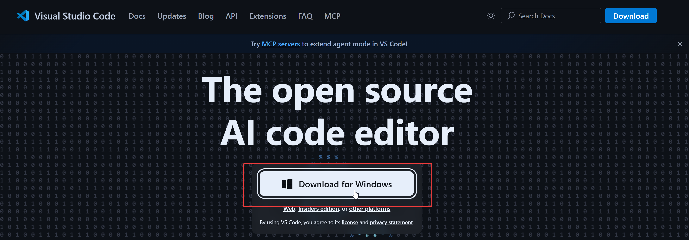{ width="600" }
</figure>

2. You will be presented with the license agreement. Check the agree button, then click "Next".

3. Check all the boxes (with desktop icon checked depending on your preference) and click "Next".

<figure markdown="span">
  { width="600" }
</figure>

4. Click "Install".

5. It will then install. Check the button to launch it, then click the "Finish" button when complete.

<figure markdown="span">
  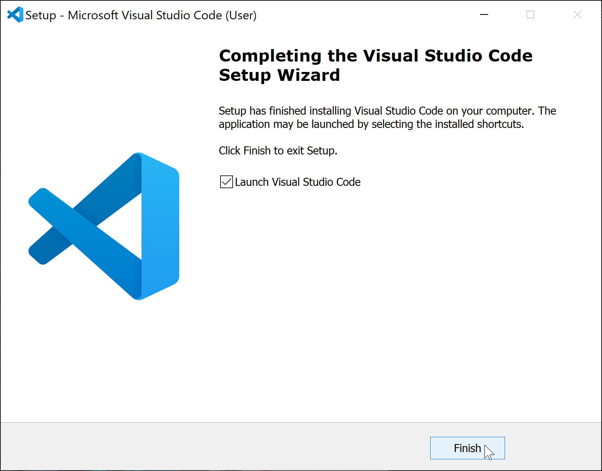{ width="600" }
</figure>

6. **If you wish to disable the AI features** aka "Copilot", go to the top bar and type in `>copilot disable`. You should be presented with options like this. Click "Disable Completions". This should disable any of the in-your-face AI options.

<figure markdown="span">
  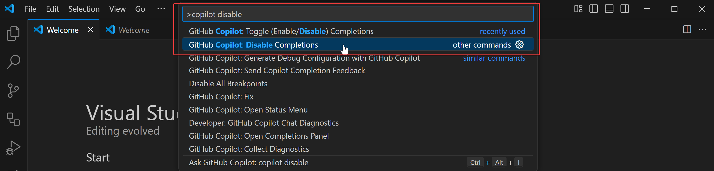{ width="600" }
</figure>

## Running Lorekeeper

We can _finally_ get to actually running Lorekeeper! 

1. Open up the File Explorer and navigate to where Lorekeeper is installed on your computer. The easiest way to do this is via Git Extensions. Click "Repository" and then "File Explorer" in the top navigation.

<figure markdown="span">
  { width="600" }
</figure>

2. Right click anywhere in the empty space (make sure you don't have a file/directory selected!) and click "Open With Code".

<figure markdown="span">
  { width="600" }
</figure>

3. Behold! All of the files that make up your Lorekeeper. However, we need to install a few files before it will work properly. In the top bar, click "Terminal" and then "New Terminal".

<figure markdown="span">
  { width="600" }
</figure>

4. Type in `composer install`. A lot of text will go flying by as composer installs the various chunks of code required for LK to run.

<figure markdown="span">
  { width="600" }
</figure>

**It may get stuck for a while on `Generating optimized autoload files`. Be patient! It will finish eventually.**

<figure markdown="span">
  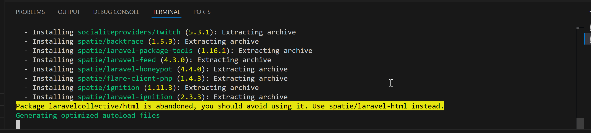{ width="600" }
</figure>

It should look like this when done:

<figure markdown="span">
  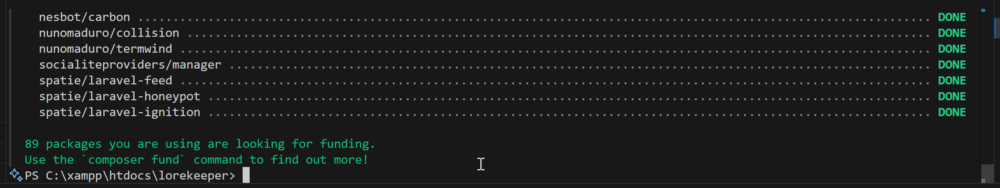{ width="600" }
</figure>

5. Next, we will create the .env file, which will define some variables that Lorekeeper needs to run. Right-click near the bottom of the file list and click "New File". Name this file `.env`.

<figure markdown="span">
  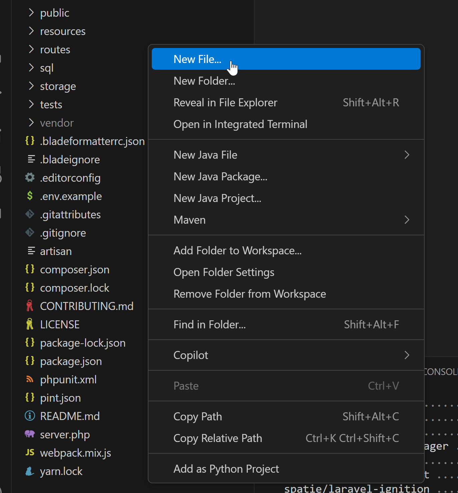{ width="600" }
</figure>

6. The file should open by default (if not, double click it to open it). You will see a screen like this:

<figure markdown="span">
  { width="600" }
</figure>

8. **We're going to paste a lot of text here!** Here is the contents to paste into this file:

```
APP_NAME=Lorekeeper
APP_ENV=local
APP_KEY=
APP_DEBUG=true
APP_URL=http://localhost

CONTACT_ADDRESS=
DEVIANTART_ACCOUNT=
 
LOG_CHANNEL=stack
DB_CONNECTION=mysql
DB_HOST=127.0.0.1
DB_PORT=3306
DB_DATABASE=lorekeeper
DB_USERNAME=root
DB_PASSWORD=

BROADCAST_DRIVER=log
CACHE_DRIVER=file
QUEUE_CONNECTION=sync
SESSION_DRIVER=file
SESSION_LIFETIME=120

BROADCAST_DRIVER=log
CACHE_DRIVER=file
QUEUE_CONNECTION=sync
SESSION_DRIVER=file
SESSION_LIFETIME=120

REDIS_HOST=127.0.0.1
REDIS_PASSWORD=null
REDIS_PORT=6379

MAIL_DRIVER=smtp
MAIL_HOST=smtp.mailtrap.io
MAIL_PORT=2525
MAIL_USERNAME=null
MAIL_PASSWORD=null
MAIL_ENCRYPTION=null

AWS_ACCESS_KEY_ID=
AWS_SECRET_ACCESS_KEY=
AWS_DEFAULT_REGION=us-east-1
AWS_BUCKET=

PUSHER_APP_ID=
PUSHER_APP_KEY=
PUSHER_APP_SECRET=
PUSHER_APP_CLUSTER=mt1

MIX_PUSHER_APP_KEY="${PUSHER_APP_KEY}"
MIX_PUSHER_APP_CLUSTER="${PUSHER_APP_CLUSTER}"
```

9. Save the file. Now, go back to the terminal. We are going to run a few setup commands. Type in `php artisan key:generate`. You will see something like this:

<figure markdown="span">
  { width="600" }
</figure>

10. Next, type in `php artisan migrate`. This will populate the database with all of the tables that Lorekeeper needs to function. You'll see a LOT of text start to fly by. It should look like this when completed:

<figure markdown="span">
  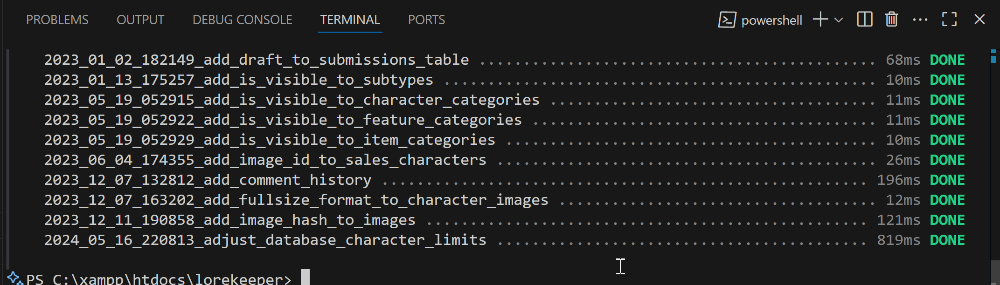{ width="600" }
</figure>

11. Now for some Lorekeeper-specific commands. Run `php artisan add-site-settings` to populate the database with the site settings. It should look like this when completed:

<figure markdown="span">
  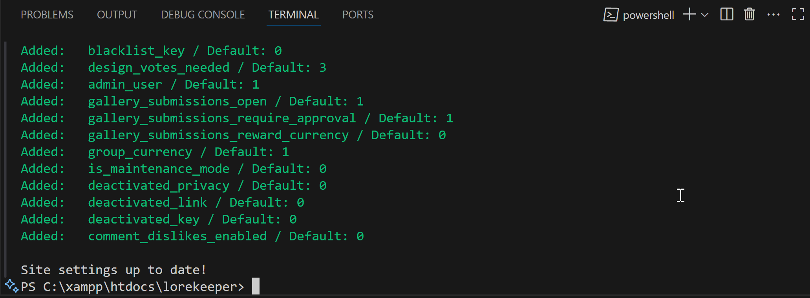{ width="600" }
</figure>

12. Then run `php artisan add-text-pages`. This will add the default text pages for LK:

<figure markdown="span">
  { width="600" }
</figure>

13. Next run `php artisan copy-default-images`. This will add the default images for various features on LK:

<figure markdown="span">
  { width="600" }
</figure>

14. Finally, we will run the command `php artisan setup-admin-user`. This will create user #1, the default admin account. The email and details you give it do not need to be real, but make them something you'll remember easily.

The important details to mark as `yes` have been highlighted in red.

- `Proceed to create account with this information? (yes/no)`
- `Are you on a local/testing instance and not a live site? (yes/no)`
- `Would you like to mark your email address as verified and enter an alias now? (yes/no)`

<figure markdown="span">
  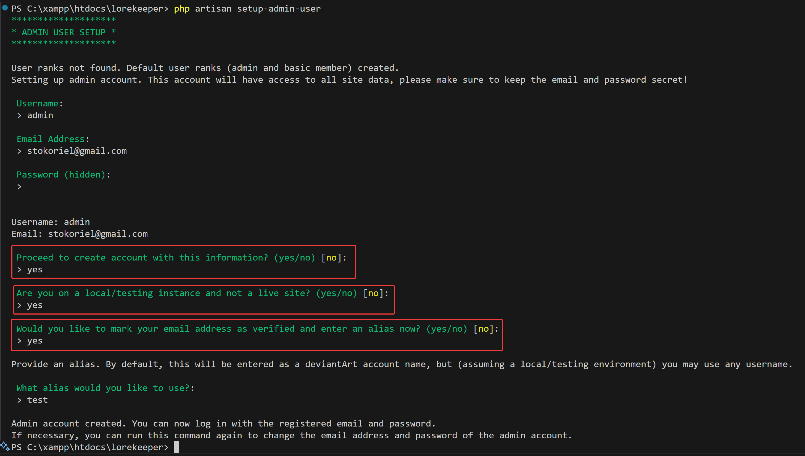{ width="600" }
</figure>

15. Now, go to `http://localhost` in your browser. You can also access this by pressing the "Admin" button next to "Apache" in XAMPP.

<figure markdown="span">
  { width="600" }
</figure>

**Congratulations!** You have finished installing a local copy of Lorekeeper. You can login as the admin account you just set up, and begin trying out the different features.

<figure markdown="span">
  { width="600" }
</figure>