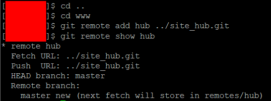
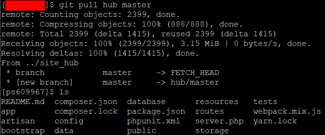
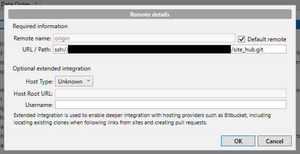

# Tutorial: Setting Up

## Visual Guides

Some Lorekeeper users have written extensive guides on setting up:

- [Juni](http://junijwi.deviantart.com/)'s [Dreamhost visual setup guide](https://docs.google.com/document/d/1mpb1KJIKN_yi8aXOs6AwfRrf5D0XwvQxbvmPa3t31xg/edit#heading=h.4dhzdpddx1gk)
- [wych(witch)](http://wychwitch.deviantart.com/)'s [DigitalOcean visual setup guide](https://docs.google.com/document/d/1deGtEdt9Dka3OpIHE7esEAfmrkvdRejHGOQxFu1TWP8)

Recommended to use either of these guides as they're highly detailed and contain more screenshots!

**What is the difference?**

These guides pertain to setting up on different webhosts. The outcome is the same, but cost of webhosting and involvement in setting up varies - please read through the guides and choose the type of webhosting that fits your needs/budget/time!

The information below is the same as detailed in Juni's guide, but more general/doesn't contain info about setting up on a shared server/configuring passwordless login.

## Requirements

Requirements for a web host (assuming it's running on some variant of Unix):

- PHP 7.2
- MySQL
- SSH access

If you're not familiar with any of these and don't want to spend too much time shopping around hosts, I personally recommend going with [DreamHost](https://www.dreamhost.com/)'s VPS (the cheapest plan will do) as they have everything necessary (the [demo site](http://lorekeeper.me/) is hosted by them) and their own written instructions for some of the steps in the setup, which I have linked below.

Additional software requirements:

- [PuTTY](https://www.putty.org/) (if using Windows) / a program that can be used to SSH into your server
- A Git client (e.g. [Sourcetree](https://www.sourcetreeapp.com/))
- A text editor (Notepad works, but I recommend something more featured e.g. [Visual Studio Code](https://code.visualstudio.com/), [Notepad++](https://notepad-plus-plus.org/downloads/))
- A command line program (for your computer - on windows, this is Command Prompt)

## Preface

Setting up your own copy of Lorekeeper consists of 3 main steps:

1. Uploading a copy to your web host
2. Setting up the database/admin account configuration
3. Site configuration/adding your ARPG data/modifying the source code

If you have a personal favourite method of setting up your workflow, I would strongly recommend going with what you're comfortable with! Jump ahead to step 2 as there are a few commands you have to run from the command line.

Otherwise, for this tutorial, I'll assume that you have never touched Git and worked on the command line before, and will run through the steps I go through to get this up and working, with my usual workflow. Refer to the basic version of the tutorial to get it uploaded with less fuss, but less convenience working with the source code.

## Uploading

We're going to set this up so that we can use Git to manage changes to the site. The setup is based on [this article](http://joemaller.com/990/a-web-focused-git-workflow/) (with a few modifications + expanding on the comments).

### Obtaining Local and Server Copies

First, we want to make sure we have the software we need. For Windows PCs, download PuTTY from [here](https://www.putty.org/) and install/set it up (click [here](https://help.dreamhost.com/hc/en-us/articles/215464538-How-do-I-configure-PuTTY-) for instructions).

Next, we need hosting and a domain name. I'll be using Dreamhost in the examples of this tutorial for hosting.

Set up the domain name so it points to your server. How to do this depends on where your domain name is registered, so check the instructions they should have provided.

Obtain a copy of Lorekeeper. The recommended way to do this is to git clone it on your computer - there are various ways of doing this, but the simplest way is probably to clone it from your Git client. This will also initialise it as a Git repository on your computer. Now, you have a copy of Lorekeeper on your computer that you can use for working. I'll call this your **local copy**, and the one on your server the **server copy** (or live site).

We're going to get the code onto the server. Using your SSH client (PuTTY on Windows/Terminal on Mac) SSH into your server - [here](https://help.dreamhost.com/hc/en-us/articles/216041267) are Dreamhost's very detailed instructions on how to do that.
From here on, you can enter the commands almost exactly as they are.

Navigate to the directory we're putting the files in.

```sh
cd
```

Make a directory for your site - name it whatever you want. In this example I'll use "site-name.com", so replace that with your site name.

```sh
mkdir site-name.com
cd site-name.com
```

Make a directory called `www`, go in and `git init` it.

```sh
mkdir www
cd www
git init
```

Go back out and make a second directory named `site_hub.git` and init it as a bare repository.

```sh
cd ..
mkdir site_hub.git
cd site_hub.git
git --bare init
```

<figure markdown="span">
  { width="600" }
  <figcaption>Creating and initialising the directories on the server.</figcaption>
</figure>

Go to your Git client (e.g. Sourcetree as suggested above), select your folder containing Lorekeeper's code and add `site_hub.git` as a remote. The address is similar to your SSH address but points directly to the folder, something like `ssh://username@host.com/~/site-name.com/site_hub.git`.

If successful, push the code to the remote. In Sourcetree, right click on the remote, choose to push, select the master branch and click OK.

<figure markdown="span">
  { width="600" }
  <figcaption>Adding the remote in Sourcetree.</figcaption>
</figure>

Back in the SSH client, we'll add `site_hub.git` as a remote for `www`.

```sh
cd ../www
git remote add hub ../site_hub.git
```

At this point if you enter `git remote show hub`, you should see something like:

```sh
* remote hub
  URL: /home/your_username/site-name.com/site_hub.git
```

<figure markdown="span">
  { width="600" }
  <figcaption>Adding the remote on the server.</figcaption>
</figure>

Run a git pull.

```sh
git pull hub master
```

Wait for it to finish running, and if it looks like nothing went wrong, enter `ls` and see that there are files inside the directory.

<figure markdown="span">
  { width="600" }
  <figcaption>Running git pull.</figcaption>
</figure>

### Git Hooks

If everything looks good, we'll set up git hooks so that updating the site is as easy as pushing a button.

Continue by entering

```sh
cd .git/hooks
nano post-commit
```

This will bring up a blank text editor. Enter the following text:

```sh
#!/bin/sh

echo
echo "**** Pushing changes to Hub [Prime's post-commit hook]"
echo

git push hub
```

To save the file, enter in order: Ctrl + X, y, enter.

Then, we'll change the permissions on the file:

```sh
chmod +x post-commit
```

We'll also add a hook in `site_hub.git`.

```sh
cd ../../../site_hub.git/hooks
nano post-update
```

The contents of this file (note the directory name you have to edit below!!):

```sh
#!/bin/sh

echo
echo "**** Pulling changes into Prime [Hub's post-update hook]"
echo

cd $HOME/site-name.com/www || exit
unset GIT_DIR
git pull hub master

exec git-update-server-info
```

Once again: Ctrl + X, y, enter.

And again, we'll change the permissions on the file:

```sh
chmod +x post-update
```

You can now test the hooks by modifying something harmless on your local copy (such as a comment) and commit/pushing the change to the server.

<figure markdown="span">
  { width="600" }
  <figcaption>Creating a hook.</figcaption>
</figure>

If set up correctly, the output log should display the message you wrote in post-update and show that the file was updated without errors.

For a small but important tweak, we'll change the origin of our repository to point to the new site. This is demonstrated in Sourcetree, but should not be too much different in other clients.

1. Checkout the site's master branch.
2. Rename the old origin branch.
3. Change the site's master branch to origin.

In the future, you (and other users who have access to the repository) can simply push new changes to the code through your Git client at the click of a button, which also keeps track of files that you've added and/or modified, and contains a log of who made what changes to the code. Hooray!

<figure markdown="span">
  { width="400" }
  { width="400" }
  { width="400" }
</figure>

## Setting up

### Web Directory

Update your domain to point to the www/public folder.

For DreamHost users, this is under Manage Domains > Edit > Web directory. The page may take a few hours to update, and display an error if you have not completely finished the setup yet (this is normal).

<figure markdown="span">
  { width="600" }
  <figcaption>Sample web directory.</figcaption>
</figure>

### Install Composer

Packages for the project are installed through Composer. You'll want to have it installed both on the server and on your computer.

- Instructions for installing Composer on your server are [here](https://help.dreamhost.com/hc/en-us/articles/214899037).
- Instructions for installing Composer on your computer are [here](https://getcomposer.org/doc/00-intro.md).

I recommend following the global instructions. If you follow the local setup, place `composer.phar` in the `www` directory.

Additionally, if you're using DreamHost, you will want to change the default PHP version for convenience. See [here](https://help.dreamhost.com/hc/en-us/articles/214202148) for instructions.

Note: At the time of coding, I was using PHP 7.2; when changing the PHP version make sure to use either 7.2 or 7.3. (i.e. replace all instances of php74 with php72 or php73)

### Packages and Database Setup

In your SSH client, navigate to the www folder and run composer install. (Do this also on your own computer, but navigate to the appropriate directory instead)

```sh
cd ~/site-name.com/www
composer install
```

Let it finish running. After that, we'll set up the database.

If you're not on DreamHost or are setting up your local copy:
This is easiest through phpMyAdmin, so navigate to your site's phpMyAdmin in your browser.

Click on "Databases" in the top bar, and add a database - it can be called anything you like.

If you're on DreamHost, go to the control panel to set up a database (see image on right). Be sure to choose names and a password that cannot be easily guessed and note them down! You will need the **database name**, **database user** (the New Username field) and **database user password** (the New Password field) later. The **hostname** can be used to access PHPMyAdmin - note this down as well.

<figure markdown="span">
  { width="600" }
  <figcaption>Creating a DreamHost database in the control panel.</figcaption>
</figure>

### API Keys

Now, we need to get access to services that will allow us to send e-mails (for registration/resetting passwords) and connect to deviantART (for verifying accounts).

For a small site with little traffic, I'd suggest [SendGrid](https://sendgrid.com/) (100 mails a day on their free plan), though you can use any service that you like.

If you're using Sendgrid, after you've created your account, go to API Keys under Settings in the Control Panel and create a new key. Note down the generated **SendGrid API key** as we'll need it later. Keep this a secret!

On deviantART, while logged in, go to the developer area.

Click on Register Your Application.

Give your application a name as you would a deviation, and under both `OAuth2 Redirect URI Whitelist` (Required) and `Original URLs Whitelist`, put your site's URL (e.g. `http://site-name.com`). Click save.

This will add an application under Un-Published Applications on the developer page - you don't need to publish the application to use it.

Note down the deviantART `client_id` and deviantART `client_secret`. We'll use these later, and again, keep the secret a secret!

I recommend creating a second application for use with your local copy rather than using the same application. In this application, instead of your site URL, add localhost (e.g. I use `http://127.0.0.1`).

### .env

Now, let's use that information.

The site requires a file named `.env` to be placed in the root directory of your site (in the `www` directory). We'll do this in both the local copy and the server copy, but with a few differences.

Create a file both locally and on the server that contains the following, filling out the fields as noted (avoid using spaces in names):

```
APP_NAME=site_name_with_no_spaces
APP_ENV=
APP_KEY=
APP_DEBUG=
APP_URL=

CONTACT_ADDRESS=your_contact_address@site-name.com
DEVIANTART_ACCOUNT=your-dA-group-account-username

LOG_CHANNEL=stack

DB_CONNECTION=mysql
DB_HOST=
DB_PORT=
DB_DATABASE=
DB_USERNAME=
DB_PASSWORD=

BROADCAST_DRIVER=log
CACHE_DRIVER=file
QUEUE_CONNECTION=sync
SESSION_DRIVER=file
SESSION_LIFETIME=120

REDIS_HOST=127.0.0.1
REDIS_PASSWORD=null
REDIS_PORT=6379

MAIL_DRIVER=smtp
MAIL_HOST=smtp.sendgrid.net
MAIL_PORT=587
MAIL_USERNAME=apikey
MAIL_PASSWORD=your_sendgrid_api_key
MAIL_FROM_ADDRESS=noreply@site-name.com
MAIL_FROM_NAME=mail_sender_name

AWS_ACCESS_KEY_ID=
AWS_SECRET_ACCESS_KEY=
AWS_DEFAULT_REGION=us-east-1
AWS_BUCKET=

PUSHER_APP_ID=
PUSHER_APP_KEY=
PUSHER_APP_SECRET=
PUSHER_APP_CLUSTER=mt1

MIX_PUSHER_APP_KEY="${PUSHER_APP_KEY}"
MIX_PUSHER_APP_CLUSTER="${PUSHER_APP_CLUSTER}"

DEVIANTART_CLIENT_ID=your_deviantart_client_id
DEVIANTART_CLIENT_SECRET=your_deviantart_secret
DEVIANTART_CALLBACK_URL=/
```

Leave the APP_KEY blank, as it will be generated in a later step.

On the **local version**, find and fill out the following lines as such (if you created an extra app for testing on deviantART, change the dA client ID and secret to that):

```
APP_ENV=local
APP_DEBUG=true
APP_URL=http://localhost

DB_HOST=127.0.0.1
DB_PORT=3306
DB_DATABASE=your_local_database_name
DB_USERNAME=root
DB_PASSWORD=
```

(Note that in the image to the right, Mailtrap.io is being used for local emails and the CONTACT_ADDRESS and DEVIANTART_ACCOUNT options are missing, but should be required.)

On the **server version**, find and fill out the following lines as such:

```
APP_ENV=production
APP_DEBUG=false
APP_URL=http://site-name.com

DB_HOST=your_database_hostname
DB_PORT=3306
DB_DATABASE=your_server_database_name
DB_USERNAME=your_server_database_user_name
DB_PASSWORD=your_server_database_user_password
```

<figure markdown="span">
  { width="600" }
  <figcaption>Comparison of local (left) and server (right) .env.</figcaption>
</figure>

### Command Line Setup

Moving on to command line setup - now that we have the files in place, we're going to create the database tables, insert some basic required data, and get the crons (scheduled scripts; primarily for scheduled news posts) working.

On both local and on the server, run the following, letting each complete before the next one:

```sh
php artisan key:generate 
php artisan migrate
```

This will generate the app key (used for encryption) and create the database tables.

Run the following commands afterwards:

```sh
php artisan add-site-settings
php artisan add-text-pages
php artisan copy-default-images
```

Then, we'll set up the admin user:

```sh
php artisan setup-admin-user
```

This will prompt you for the creation of the admin account, which will have access to all site data. On the live site, I would recommend using this as a purely administrative account and not the site owner's personal account. You can run this command again to change the email address and password of the account.

At this point, you should be able to log into the site with the admin account.

### Cron Jobs

Finally, we'll set up the crons so we can make use of scheduling.

**For non-DreamHost users:**
Refer to [this article](https://www.lifewire.com/crontab-linux-command-4095300) for how to edit the crontab file.

Add the following line, editing the directory name as necessary:

```sh
* * * * * cd ~/site-name.com/www && php artisan schedule:run >> /dev/null 2>&1
```

**If you are using DreamHost:**

Go to the control panel, click on More > Cron Jobs > Add New Cron Job.
Select the shell user, enter a title (not important; you can set this to your site name for easy identification), and under command to run, add:

```sh
cd ~/site-name.com/www && php artisan schedule:run >> /dev/null 2>&1
```

Then choose the following options:

- **When to run:** Custom
- **Minutes:** Selected Minutes
    - In the combo box, choose every multiple of 5. DreamHost restricts cron jobs to run every 5 minutes at the very least, so unfortunately you can't get to-the-minute accuracy.

If you can view the site from the URL - congratulations, you've set up the site successfully!

## Site Configuration

Before we start adding data, let's edit the config files in the code, making use of Git to send your updates to the server.

### Config Files

In your local copy, open up `config/app.php` in your text editor of choice. The code is commented in detail, so you can read and modify the config as you need. Most settings do not need to be touched since you wrote them in .env, but you may want to edit the **timezone** to match the clock your community goes by.

Open up `config/lorekeeper/settings.php`. Similar to the above, you can read the comments and modify the config as required.

In your Git client, choose the modified files, commit and push them (important: to your server, not Github!) with a helpful message. If the hooks have been set up correctly, you should see the effects on the live site after it's done. If not, and there were no errors, you may need to run `php artisan config:clear` on the server.

### Site Data

Now we can start editing the site data. All changes on the live site will only stay on the live site, and all local changes will only remain local.

Log in as the admin user and go to the admin panel (click the crown in the navigation bar). The first things you may want to edit are:

- Site Settings
- User Ranks (create moderator ranks)
- Pages (Terms of Service, Privacy Policy, About)
- Site Images

You can, of course, dive right into editing the game data - I would recommend editing in the order:

- rarities
- categories (trait categories, item categories, prompt categories, character categories)
- species, traits, items, currencies
- loot tables
- prompts, shops

Note that at least 1 character category is required to create any characters. More specific information about each type of data can be found on the respective documentation pages.

## Troubleshooting

- **Composer install error: The filter extension is missing.**
    - You are probably using PHP 7.4 on the command line, change it to 7.2 or 7.3.
- **PHP Fatal error: Uncaught Error: Call to undefined function JsonSchema\Uri\filter_var() in …**
    - Same as above, change to PHP 7.2 or 7.3.
- **500 Server Error trying to send emails**
    - For people who registered accounts after April 6 2020, SendGrid requires the sender identity to be verified. See [this article](https://sendgrid.com/docs/for-developers/sending-email/sender-identity/) for details.