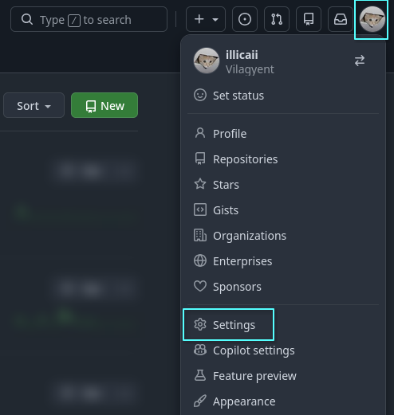
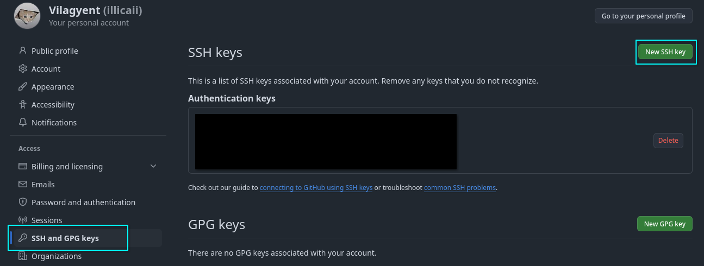
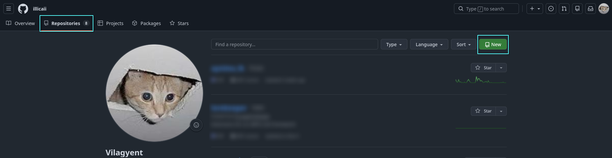
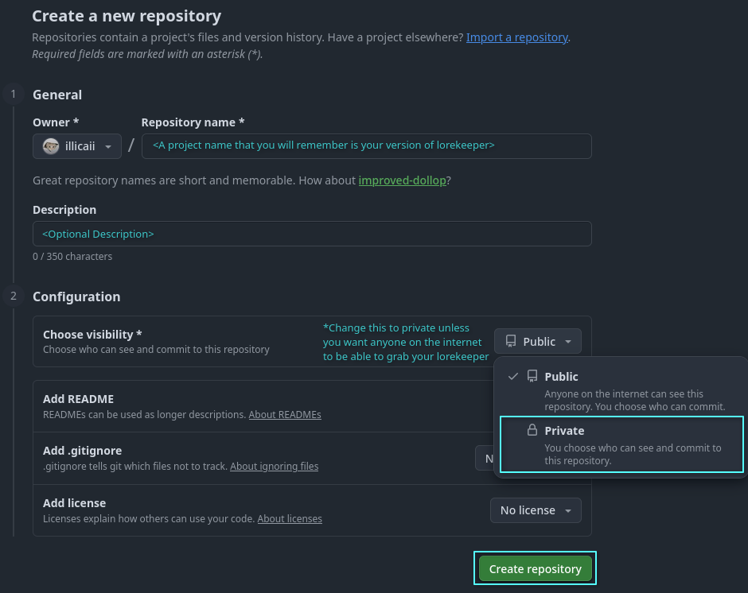
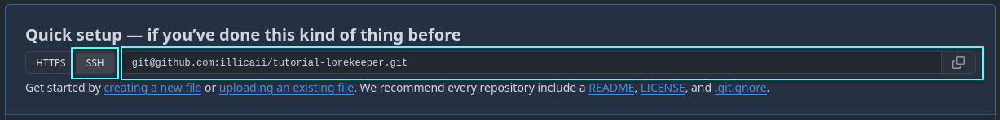
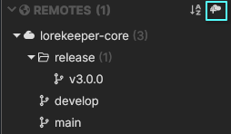
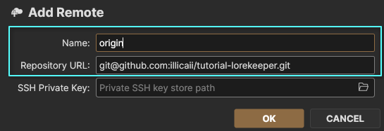
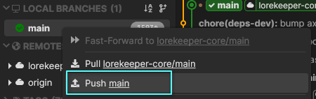
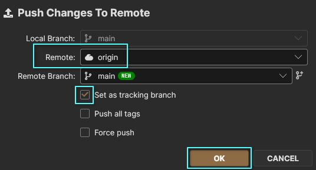
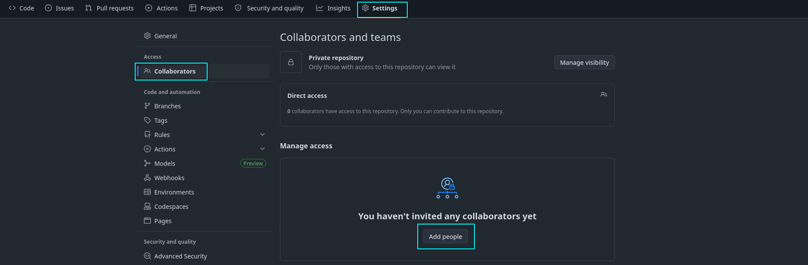

# Github Setup

!!! example "WIP"

    Please include information here for Windows/Mac.

We have already interacted with github once to create our local copy of code, however the core lorekeeper repository on github is not something we can (or would want to) push our personal code to. In order to store our customized codebase and track changes to it, we will need to create our own private repository.

This guide can be followed regardless of the operating system you are on. Steps with differences, will have the OS specific commands listed.

## Github SSH Key Authorization

If you have not already created SSH keys, follow the OS specific instructions [here](software-setup/ssh-clients.md) before completing these instructions.

1. View the contents of your public key and copy what is printed out:

Windows
: TODO

Mac
: TODO

Linux
: `cat ~/.ssh/id_rsa.pub`

2. Navigate to [your Github account](https://github.com/).
3. Add SSH key to your Github by navigating to:
: **Settings**
<figure markdown="span">
      { width="600" }
</figure>

: **SSH and GPG keys**, select **New SSH key**
<figure markdown="span">
      { width="600" }
</figure>

Give the key a name you will be able to remember is related to your computer and place the contents of your copied key here. Then click **Add SSH Key**

<figure markdown="span">
  { width="600" }
</figure>

3. Next, add your github credentials to your global git config in the terminal
: `git config --global user.name <user_name>`
: `git config --global user.email <email_id>`

!!! info "Note"

    Do not create additional keys for other people on your github account. Any keys you add in this section will be able to interact as **YOUR** account. See the [adding collaborators](#adding-collaborators-to-a-private-github-repo) section below to add others to your private repo so they can interact with it.

## Create Private Github Repo
First, we have to create a repo in github for you to push your code to. Navigate to your repositories on [github.com](https://github.com/) and click **"New"**
<figure markdown="span">
      { width="600" }
</figure>

Give the repository a name and change the visibility to **Private**. Then click **Create Repository**
<figure markdown="span">
      { width="600" }
</figure>

Copy the **SSH** address from the Quick Setup section of the page.
<figure markdown="span">
      { width="600" }
</figure>

## Rebasing Local Code
Moving back to SourceGit, we need to add your newly created remote repo. Click the cloud with plus icon next to the "REMOTES" category.

<figure markdown="span">
      { width="600" }
</figure>

Paste the link you copied from github and name it "origin" and then click "OK":
<figure markdown="span">
      { width="600" }
</figure>
*Note: If you run in to errors, make sure you have copied the SSH address rather than the https address of your remote repo*

After some loading, we now have our new remote!

To commit our local changes to it for the first time, simply right click the local branch **"main"** and select **"push main"**.
<figure markdown="span">
      { width="600" }
</figure>

In the menu that appears, select **"origin"** as the remote and click **"Set as a tracking branch"**.
<figure markdown="span">
      { width="600" }
</figure>

## Adding Collaborators to a Private Github Repo
*(Optional) You can skip this step if you do not have any collaborators working on your code.*

To add collaborators for your private repository:

1. Navigate to the repo you wish to add people to on Github
2. Click **Settings** --> **Collaborators** --> **Add People**
<figure markdown="span">
      { width="600" }
</figure>

3. Enter the collaborator's username, full name, or email to add them to the repository.

## Setup Complete
Congrats, we now have a version of lorekeeper attached to our personal remote github repo. You can now start developing your lorekeeper and tracking those changes in your remote repo. When you are ready, you can move onto [configuration or setting up a live website](../setup-index.md#webserver-live-set-up).