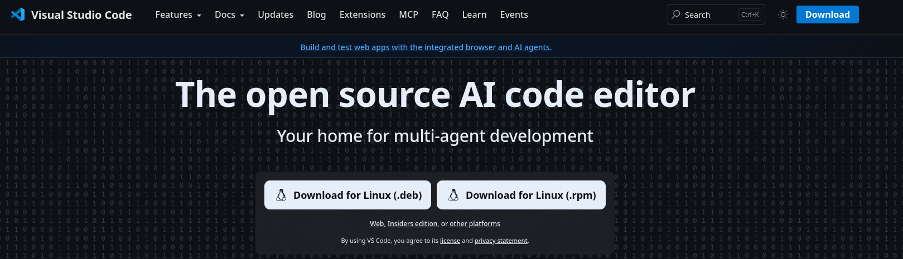
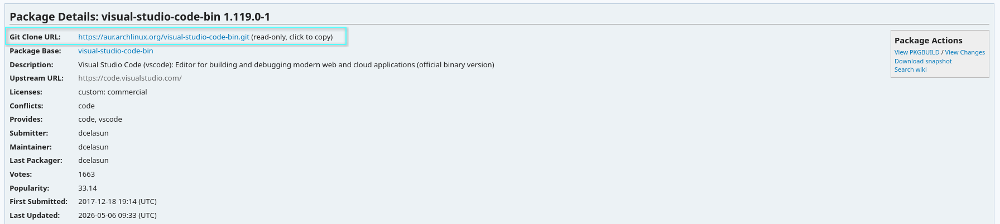
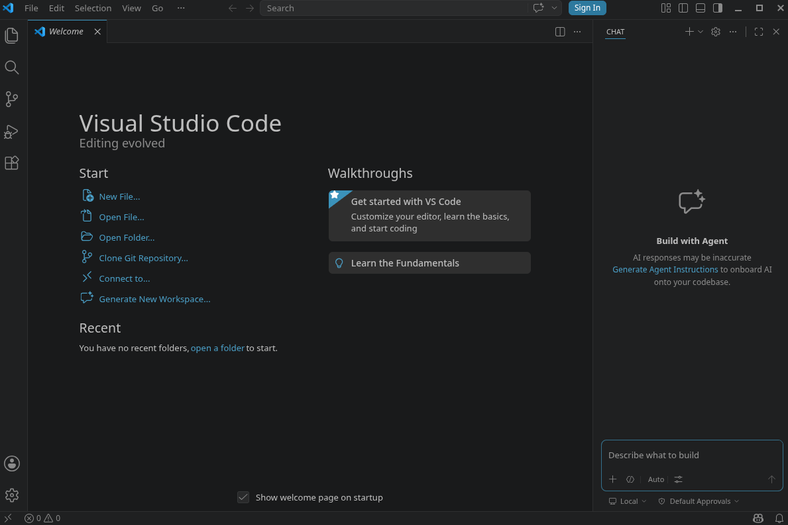

# Local Software Setup - Linux

## Overview

- **This guide assumes you are on a Arch-based distro of linux and use the package manager pacman.** For Debian or Fedora based distros, your process will look similar, however package managers and exact installation commands will differ.
- [Windows](software-windows.md) and [Mac](software-mac.md) will have different setup methods.
- **Please read every step of this guide carefully.** It is highly recommended to do a full read-through before you start. This guide is meant to be beginner friendly, HOWEVER, be aware linux can be a bit of a beast if you are not familiar with it. Be patient and **do not skip steps**. If you get an error make sure you resolve it before moving on to the next step. Moving on before the error is resolved will most likely lead to problems later.

Within this guide, we will install the following:

- [Microsoft VS Code](https://code.visualstudio.com/download) or [VSCodium](https://vscodium.com/) as our IDE for editing lorekeeper files.
- [Git](https://git-scm.com/) as our version control software
- [SourceGit](https://sourcegit-scm.github.io) for our graphical git client

!!! info "Replace the <text\> with your own info"
    For the purposes of this guide, when you need to fill in your own text, it will be enclosed in angle brackets: `<Explaination Text>`.

    For example, if the guide gives the command `cd <Your Lorekeeper Directory> ` and your lorekeeper directory was in ~/Documents/lorekeeper, you would type `cd ~/Documents/lorekeeper` in your terminal window.

## IDE
First, you will need an IDE (Integrated Development Environment). IDEs are software that provide an environment to write and often test/debug code within a single, unified interface. Microsoft's Visual Studio Code is the code editor we will be installing in this guide, however there are many other IDEs and which one you use is largely up to personal preference.

!!! info "A Note for those who want to avoid Microsoft"

    You can install the [VSCodium](https://vscodium.com/), the open source cousin of VSCode, which comes with AI/Copilot features disabled by default and is up kept by the community rather than Microsoft, [here](https://github.com/VSCodium/vscodium/releases). VSCodium uses the [Open VSX Registry](https://open-vsx.org/) over the default VS Code Extension library, this means that due to licensing, some extensions may be unavailable in VSCodium.

    VSCodium can easily be installed with the following command:
    : `sudo pacman -S codium`
    or through AUR (`https://aur.archlinux.org/packages/vscodium`)

VS Code can be downloaded and built manually from the AUR repository or from the official website [here](https://code.visualstudio.com):
<figure markdown="span">
  { width="600" }
</figure>

We will be walking through the install through AUR:

1. Find the sourceGit [AUR package](https://aur.archlinux.org/packages/visual-studio-code-bin) and copy the Git Clone URL:
<figure markdown="span">
  { width="600" }
</figure>

!!! info "A Quick Aside: What is AUR"
    The Arch User Repository, aka "AUR", is **a repository of user-generated packages for Arch-based distributions**. It contains additional packages from the official Arch package repositories (which can be downloaded with `pacman`) If a package is unavailable through pacman, it's likely in the AUR! This makes it an invaluable resource;

    Because **AUR contains user-generated and maintained packages which could possibly be malicious, you should always exercise caution and review packages and updates installed from AUR**. Its always a good practice to check the upstream of the package to make sure the source is what you expect. In VSC's case, the upstream should be the their official page (`https://code.visualstudio.com/`).

    Packages you install from the AUR aren't automatically updated by `pacman`. An AUR helper, like `paru`, can help simplify this process and help keep packages from the AUR up-to-date (they should always be updated alongside the rest of the software on your computer!). We recommend `paru` in particular as it will present you with changes to a package before you install or update it, allowing you to review them-- generally, if all that changed is the version and hashes, there's no cause for concern.

2. `cd /tmp`
3. `git clone <URL copied from above: ex: https://aur.archlinux.org/visual-studio-code-bin.git>`
4. `cd visual-studio-code-bin/`
5. `makepkg -si`
6. Follow prompts in installation process

You can now launch VS Code
<figure markdown="span">
  { width="600" }
</figure>

!!! info "Disabling AI Features"
    Microsoft constantly changes how to disable AI features within Visual Studio Code, their "AI code editor". As a result, unfortunately we can not provide up-to-date instructions. Please use your favorite search engine to find the latest way to disable these features... or consider VS Codium

    The Lorekeeper community does **not** encourage, promote, or endorse usage of AI tools.

## GIT
You will also need Git. Git is a version control software that is used to manage files, file histories and merge conflicts from pulling different versions of code into your lorekeeper. It also allows multiple people to work on the same codebase without needing to manually sync all changes. Run the following command to install Git:
: `sudo pacman -S git`

Traditionally, Git is a command line software, but using a Git client makes handling it much easier. Next, we’ll install a Git client in order to have a visual GUI for Git.

## Git Client
Git clients are a good way to visualize git and version histories. There are [many git clients out there](https://git-scm.com/tools/guis?os=linux), but this guide will focus on [SourceGit](https://sourcegit-scm.github.io/).

<figure markdown="span">
  { width="600" }
</figure>

SourceGit can be downloaded from the AUR repository, or from the official github.

To install through AUR:

1. Find the sourceGit [AUR package](https://aur.archlinux.org/packages/sourcegit) and copy the Git Clone URL:
<figure markdown="span">
  { width="600" }
</figure>
: *Reminder: Always good to check the AUR repo upstream URL, in SourceGit's case, the upstream should be the github linked on their official page (`https://github.com/sourcegit-scm/sourcegit`).*

2. `cd <folder you want to put the downloaded package.>`
3. `git clone <URL copied from above: ex: https://aur.archlinux.org/sourcegit.git>`
4. `cd sourcegit/`
5. `makepkg -si`
6. Follow prompts in installation process

Now you should be able to launch SourceGit! The starting window will be pretty underwhelming.
<figure markdown="span">
  { width="600" }
</figure>

Next, we’ll configure the username and email Git will use. Go to the **hamburger bar (☰)**, then **Preferences**
<figure markdown="span">
  { width="600" }
</figure>

Go to the “Git” Tab and enter your github **User Name** and **User Email**.
<figure markdown="span">
  { width="600" }
</figure>

## Setup Complete

Congrats, you have now installed the software needed for handling Lorekeeper's code. You can now move onto [setting up your local copy of Lorekeeper](../setup-index.md#development-environment-set-up).