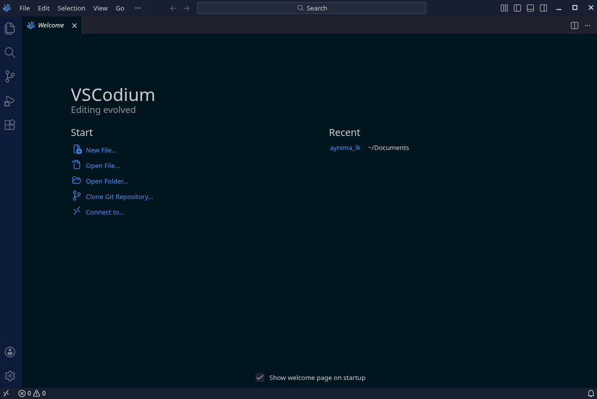
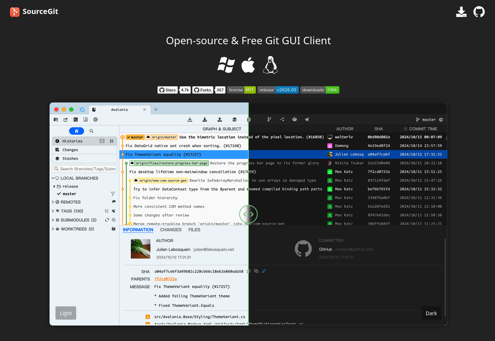
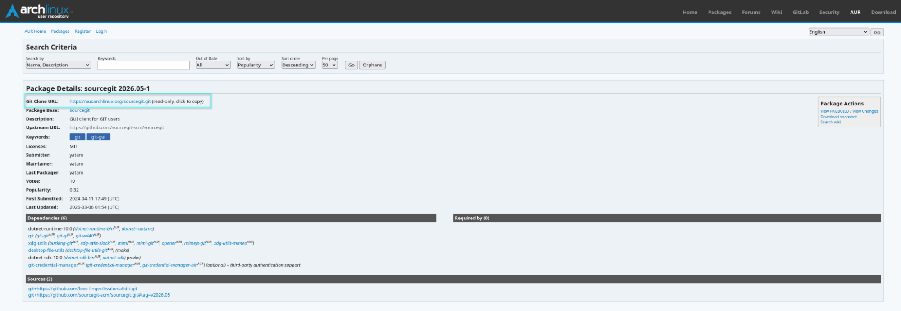
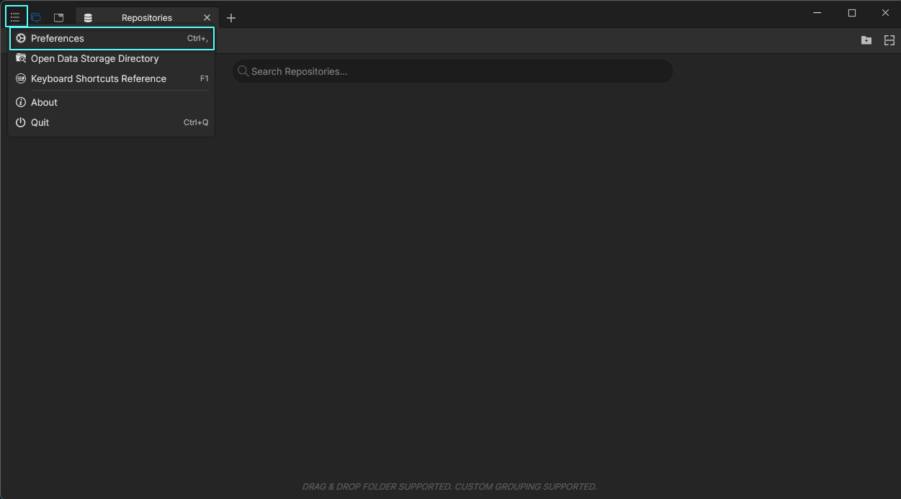
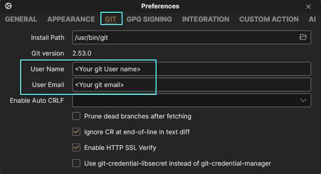
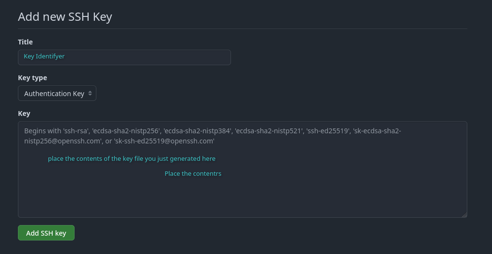

# Local Software Setup - Linux

## Overview

- **This guide assumes you are on a Arch-based distro of linux and use the package manager pacman.** For Debian or Fedora based distros, your process will look similar, however package managers and exact installation commands will differ.
- [Windows](software-windows.md) and [Mac](software-mac.md) will have different setup methods.
- **Please read every step of this guide carefully.** It is highly recommended to do a full read-through before you start. This guide is meant to be beginner friendly, HOWEVER, be aware linux can be a bit of a beast if you are not familiar with it. Be patient and **do not skip steps**. If you get an error make sure you resolve it before moving on to the next step. Moving on before the error is resolved will most likely lead to problems later.

Within this guide, we will install the following:

- [VS Codium](https://www.apachefriends.org/download.html) for editing your lorekeeper files.
- [Git](https://git-scm.com/) as our version control software
- [SourceGit](https://sourcegit-scm.github.io) for our graphical git client

!!! info "Replace the <text\> with your own info"
    For the purposes of this guide, when you need to fill in your own text it will be enclosed in angle brackets: `<Explaination Text>`.

    For example, if the guide gives the command `cd <Your Lorekeeper Directory> ` and your lorekeeper directory was in ~/Documents/lorekeeper, you would type `cd ~/Documents/lorekeeper` in your terminal window.

## Development Setup

### IDE
First you will need an IDE (Integrated Development Environment). IDEs are software that provide an environment to write and often test/debug code within a single, unified interface. We recommend [VSCodium](https://vscodium.com/), the open source cousin of VSCode.

<figure markdown="span">
  { width="600" }
</figure>

VSCodium can easily be installed with the following command:
: `sudo pacman -S codium`

### GIT
You will also need Git. Git is a version control software that is used to manage files, file histories and merge conflicts from pulling different versions of code into your lorekeeper. It also allows multiple people to work on the same codebase without needing to manually sync all changes. Run the following command to install Git:
: `sudo pacman -S git`

Traditionally, Git is a command line software, but using a Git client makes handling it much easier. Next, we’ll install a Git client in order to have a visual GUI for Git.

### Git Client
Git clients are a good way to visualize git and version histories. There are [many git clients out there](https://git-scm.com/tools/guis?os=linux), but this guide will focus on [SourceGit](https://sourcegit-scm.github.io/).

<figure markdown="span">
  { width="600" }
</figure>

SourceGit can be downloaded from the AUR repository, or from the official github.

To install through AUR:

1. Find the sourceGit [AUR package](https://aur.archlinux.org/packages/sourcegit) and copy the Git Clone URL:
<figure markdown="span">
  { width="600" }
</figure>
: *Note: Its always a good practice to check the upstream of the AUR Package to make sure the source is what you expect. In SourceGit's case, the upstream should be the github linked on their official page (`https://github.com/sourcegit-scm/sourcegit`).*

2. `cd <folder you want to put the downloaded package. This can be deleted later>`
3. `git clone <URL copied from above: ex: https://aur.archlinux.org/sourcegit.git>`
4. `cd sourcegit/`
5. `makepkg -si`
6. Follow prompts in installation process

Now you should be able to launch SourceGit! The starting window will be pretty underwhelming.
<figure markdown="span">
  { width="600" }
</figure>

Next, we’ll configure the username and email Git will use. Go to the **hamburger bar (☰)**, then **Preferences**
<figure markdown="span">
  { width="600" }
</figure>

Go to the “Git” Tab and enter your github **User Name** and **User Email**.
<figure markdown="span">
  { width="600" }
</figure>

As an additional setup step, we will now also set up your github SSH key which will allow your computer to interface with your private repos on Github. You should not share the SSH keys with anyone.
1. Generate an SSH key to use with github in a terminal window:
: `ssh-keygen -t rsa`
: And follow the prompts to create your key. It should print something like this:
<figure markdown="span">
  { width="600" }
</figure>

2. Print the contents of your public key to the clipboard and copy what is printed out:
: `cat ~/.ssh/id_rsa.pub`

3. Add SSH key to your Github
: **Settings** --> **SSH and GPG keys**, select **New SSH key**

<figure markdown="span">
  { width="600" }
</figure>

4. Add your github credentials to your global git config in the terminal
: `git config --global user.name <user_name>`
: `git config --global user.email <email_id>`

Your Github SSH key should now be set up for later use.

## Setup Complete

Congrats, you have now installed the software needed for handling Lorekeeper's code. You can now move onto [setting up your local copy of Lorekeeper](../setup-index.md#development-environment-set-up).