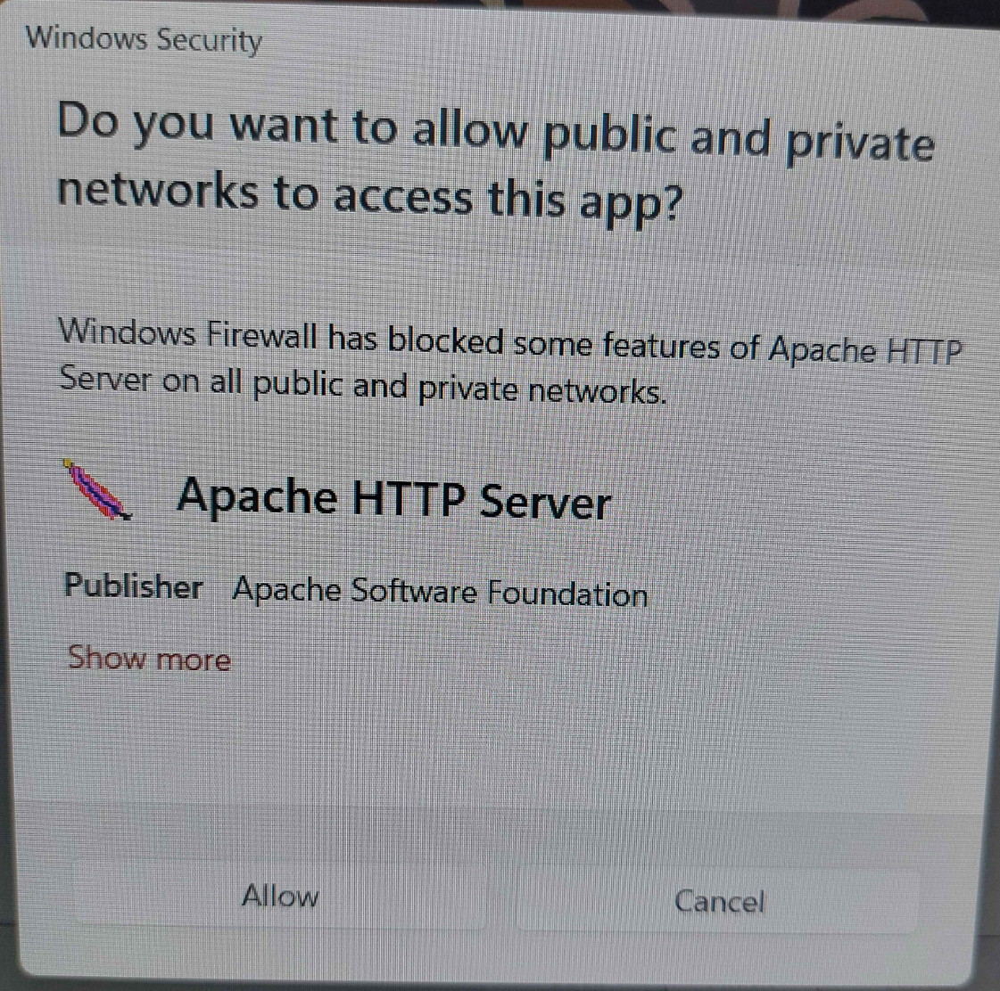
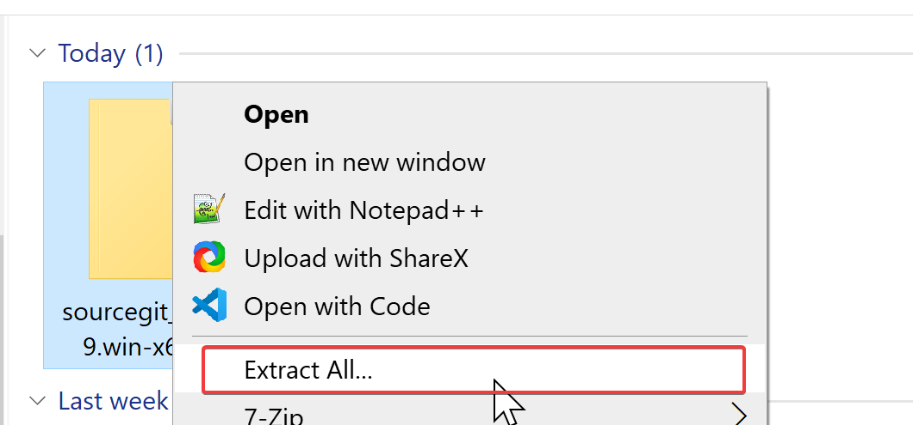
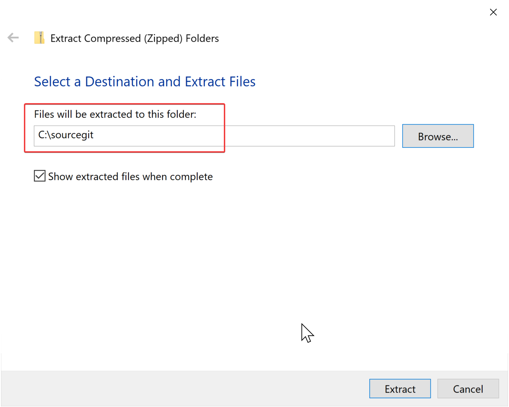
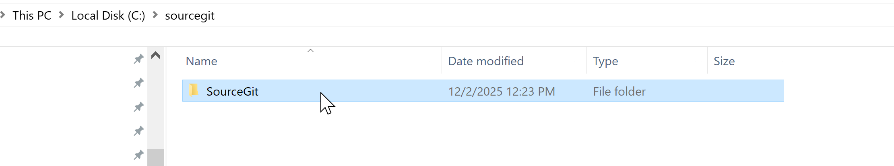
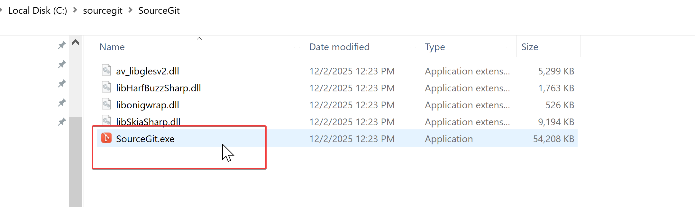
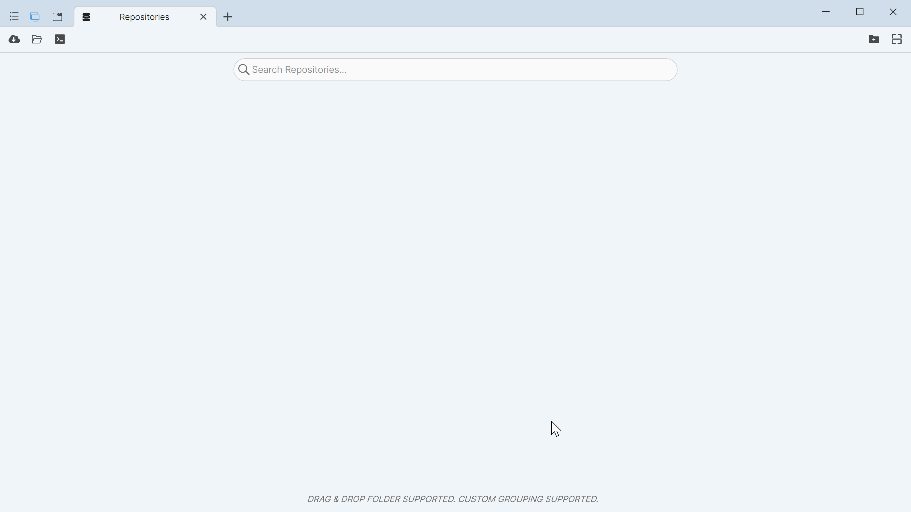
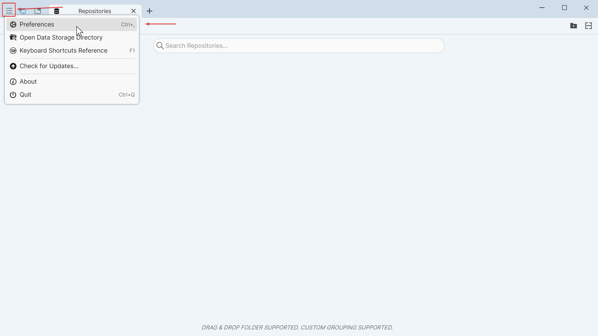
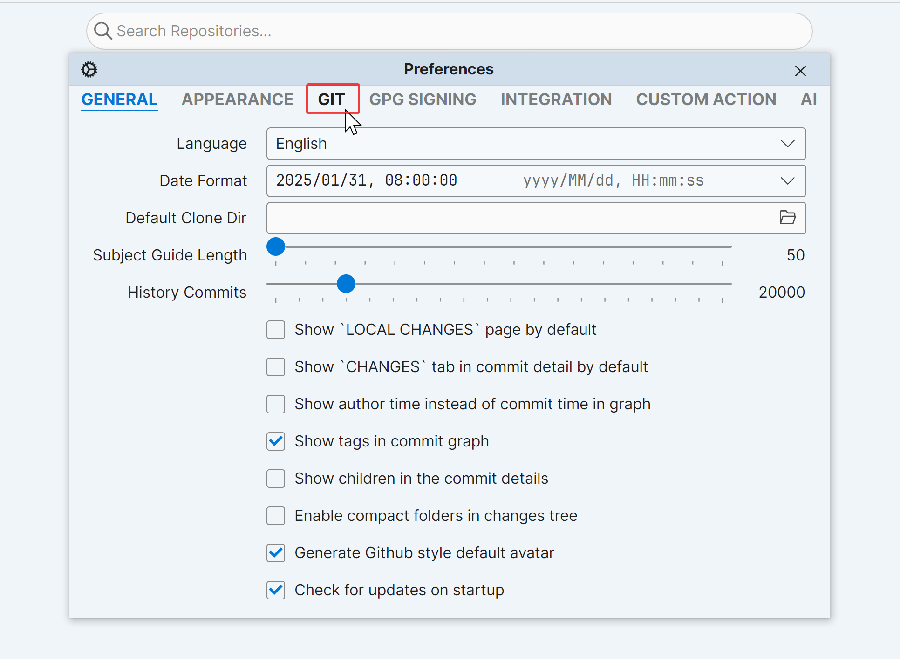
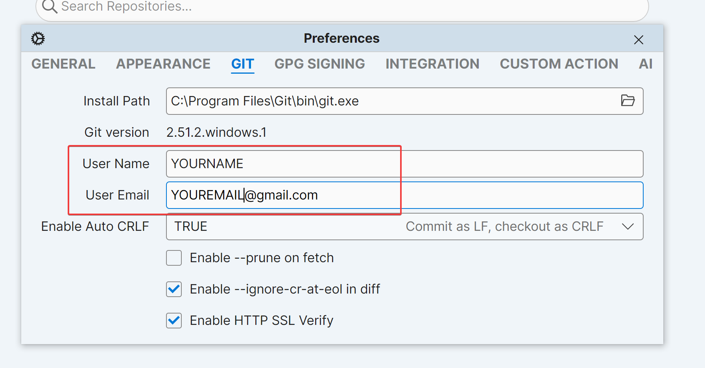
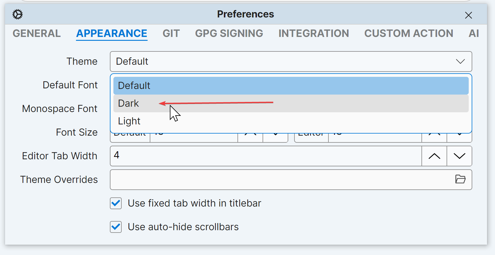

# Local Software Setup - Windows

## Overview

- **This guide assumes you are on Windows.** [Mac](software-setup/mac.md) and [Linux](software-setup/linux.md) have different methods.
- **Please read every step of this guide carefully.** It is highly recommend doing a full read-through before you even get started.

Within this guide, we will be installing the following software:

- [XAMPP](https://www.apachefriends.org/download.html) for the local webserver and database
- [SourceGit](https://sourcegit-scm.github.io) for our graphical git client

!!! info "Windows Firewall Pop-ups"
    At any point in time while installing the below software, you may see a pop-up like this. **Click "Allow" to allow the software to finish installing.** All of the recommended software is safe.

    <figure markdown="span">
    { width="600" }
    </figure>

## XAMPP Setup

### Installing XAMPP

1. Download [XAMPP](https://www.apachefriends.org/download.html).

  - For LK v2, select **PHP 8.1**.
  - For LK v3.0 or above, select **PHP 8.2**.

<figure markdown="span">
  { width="600" }
</figure>

2. Run the XAMPP .exe file. **If you see this warning, as long as you follow this guide, you can ignore it and just hit "OK".**

<figure markdown="span">
  { width="600" }
</figure>

3. Click the "Next" button. You will then see this screen. We just want the defaults -- click "Next" again.

<figure markdown="span">
  { width="600" }
</figure>

4. Install XAMPP directly onto your C: drive. A good location is `C:\xampp`, which should also be the default. Then, click "Next".

<figure markdown="span">
  { width="600" }
</figure>

5. Select your preferred language. This doesn't matter -- pick what's best for you.

<figure markdown="span">
  { width="600" }
</figure>

6. Click "Next" on the following screen. 

<figure markdown="span">
  { width="600" }
</figure>

7. XAMPP should now begin to install. This may take some time -- be patient!

<figure markdown="span">
  { width="600" }
</figure>

8. Once XAMPP has installed, check the box to start the control panel immediately (if it is not checked by default) and click "Finish".

<figure markdown="span">
  { width="600" }
</figure>

9. Congrats! You now have XAMPP installed. Click "Start" next to Apache and MySQL.

<figure markdown="span">
  { width="600" }
</figure>

!!! info "Windows Defender Firewall Alert"
    If you are presented with a window like this for either application: Check both "Private" and "Public", then click "Allow Access". 
    
    This software is safe. You may need to click "Show More" to see these options.

    <figure markdown="span">
      { width="600" }
    </figure>

### Configuring XAMPP

1. Next, we need to update the config files. Click "Config" next to Apache, and select `php.ini`.

<figure markdown="span">
  { width="600" }
</figure>

2. A file should open up in Notepad. We are going to change two values. First, use the search feature (Ctrl + F) or simply scroll down until you see `post_max_size`. This controls how large the files are that you can upload. Change this to a number similar to what you'll use on your live website. If you don't know yet, change it to `5M` (five megabytes).

<figure markdown="span">
  { width="600" }
</figure>

3. The next value we change is `upload_max_filesize`. I like to change this to abnormally high on my local, but make it whatever feels right for you. To change it to 10 megabytes, for example, put a value of `10M`.

<figure markdown="span">
  { width="600" }
</figure>

4. Save your changes and close this file. We are going to edit one more config file.

5. Go back to XAMPP, click "Config", and select `httpd.conf`.

<figure markdown="span">
  { width="600" }
</figure>

6. Another file should open up in Notepad. We are going to change one value this time. Change whatever value is currently in `DocumentRoot` and the following `Directory` line to `C:/xampp/htdocs/lorekeeper/public`.

<figure markdown="span">
  { width="600" }
</figure>

7. Save your changes and close this file. Then, click the "Stop" button next to Apache. After it **fully shuts downs**, click "Start" again.

<figure markdown="span">
  { width="600" }
</figure>

!!! info 
    Apache may fail to start if the folder `C:/xampp/htdocs/lorekeeper/public` does not exist. **This is OK.** Continue with this guide, and Apache will start after you have cloned LK.

8. Next, we are going to make one more change in anticipation of installing Lorekeeper. Click the "Admin" button next to MySQL.

<figure markdown="span">
  { width="600" }
</figure>

9. This will open a window similar to this in your browser. This is PHPMyAdmin, and it is where we control how most of the data is stored for Lorekeeper. Click "New".

<figure markdown="span">
  { width="600" }
</figure>

10. Type in `lorekeeper` or any other easy to remember name, then click "Create".

<figure markdown="span">
  { width="600" }
</figure>

11. **Congratulations! We're done here for now.** Next, we will install the Git software needed to manage our Lorekeeper files.

## Installing Git Software

Historically, the software used for managing Git was Sourcetree, but I will be using **SourceGit** as it is more stable and frequently updated.

### Installing Git

1. First, we need to install Git itself. Git is a tool used to manage files and file history for coding projects. Go [here](https://git-scm.com/downloads) to download the latest copy of Git.

Click this button...
<figure markdown="span">
  { width="600" }
</figure>

..and then this link.
<figure markdown="span">
  { width="600" }
</figure>

2. After the file is done downloading, run it. You will see this screen. Press "Next".

<figure markdown="span">
  { width="600" }
</figure>

3. You may see a screen asking about a start menu folder. The default location (often "Git") is acceptable. Press "Next".

4. **Make sure the highlighted fields are selected.** Press "Next".

<figure markdown="span">
  { width="600" }
</figure>

5. This next option is up to you. Notepad++ (if you have it installed) or Notepad are both valid options.

<figure markdown="span">
  { width="600" }
</figure>

6. For maximum compatibility with Lorekeeper, you will want to make sure you check "Override" and type in `main`.

<figure markdown="span">
  { width="600" }
</figure>

7. You will then see this screen. Select the middle/"recommended" option.

<figure markdown="span">
  { width="600" }
</figure>

8. Select "OpenSSH".

<figure markdown="span">
  { width="600" }
</figure>

9. Leave this option as whatever your computer detects as default.

<figure markdown="span">
  { width="600" }
</figure>

10. Select "Checkout Windows-style, commit Unix-style line endings".

<figure markdown="span">
  { width="600" }
</figure>

11. Select "MinTTY".

<figure markdown="span">
  { width="600" }
</figure>

12. **This one is important. Select "fast-forward or merge".**

<figure markdown="span">
  { width="600" }
</figure>

13. Select "Git Credential Manager".

<figure markdown="span">
  { width="600" }
</figure>

14. Enable both file-system caching and symbolic links.

<figure markdown="span">
  { width="600" }
</figure>

15. You may be prompted with this screen. If so, **close all other windows on your computer** and then click "Install".

<figure markdown="span">
  { width="600" }
</figure>

16. Git will then begin to install. Be patient while it completes!

<figure markdown="span">
  { width="600" }
</figure>

17. Congratulations! Git is now installed. Check "finish".

<figure markdown="span">
  { width="600" }
</figure>

18. **Reboot your entire computer.** Certain things we installed with Git will only take effect _after_ our computer has restarted. So do that, and then come back!

### Installing SourceGit

You can use Git purely from the command line, but it's not reccomended for beginners. To make things easier, we will be using a tool called **SourceGit**.

1. Go to [SourceGit's website](https://sourcegit-scm.github.io) and click the download button in the top right.

<figure markdown="span">
  { width="600" }
</figure>

2. Scroll down to the list of files. You want the version ending with **win-x64.zip**.

<figure markdown="span">
  { width="600" }
</figure>

3. Open your Downloads folder (or wherever you downloaded this file) in File Explorer. Right click the file and select "Extract all."

<figure markdown="span">
  { width="600" }
</figure>

4. Extract this file somewhere easy to remember, such as `C:/sourcegit`.

<figure markdown="span">
  { width="600" }
</figure>

4. Navigate to this folder in your File Explorer. It will contain a folder named "SourceGit". Open that folder.

<figure markdown="span">
  { width="600" }
</figure>

5. Run the file **SourceGit.exe**.

<figure markdown="span">
  { width="600" }
</figure>

!!! info "SmartScreen Warning"
    You may receive a popup from Windows warning you about the file. **This file is safe.**

    Click "More Info":
    <figure markdown="span">
      { width="600" }
    </figure>

    And then "Run Anyway" to start SourceGit:
    <figure markdown="span">
      { width="600" }
    </figure>

6. You should be presented with a relatively blank page:

<figure markdown="span">
      { width="600" }
</figure>

7. There's one final thing we need to configure, and that is the username and email that Git will use. Click the three bars in the top right, and then click "Preferences".

<figure markdown="span">
      { width="600" }
</figure>

8. Click on the "Git" tab.

<figure markdown="span">
      { width="600" }
</figure>

9. In the User Name and User Email fields, **put in information that is accurate, but you are OK with potentially being made public to anyone who works on your code.**

<figure markdown="span">
      { width="600" }
</figure>

!!! info "Customizing Appearance"
    If you want, you can also swap to Dark Mode from the "Appearance" tab.

    <figure markdown="span">
      { width="600" }
    </figure>

10. Close the Preferences window, and it will save automatically.

## Setup Complete

You have installed a local webserver and the software needed to handling Lorekeeper's code. You can now move onto [setting up your local copy of Lorekeeper](../setup-index.md#development-environment-set-up).