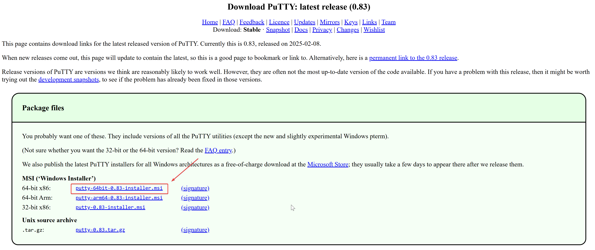
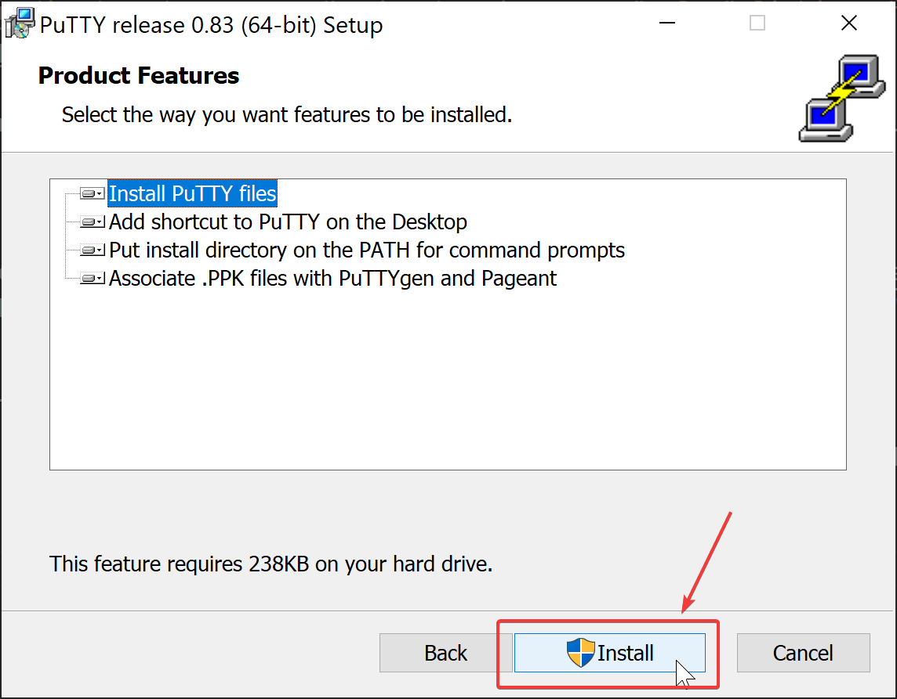
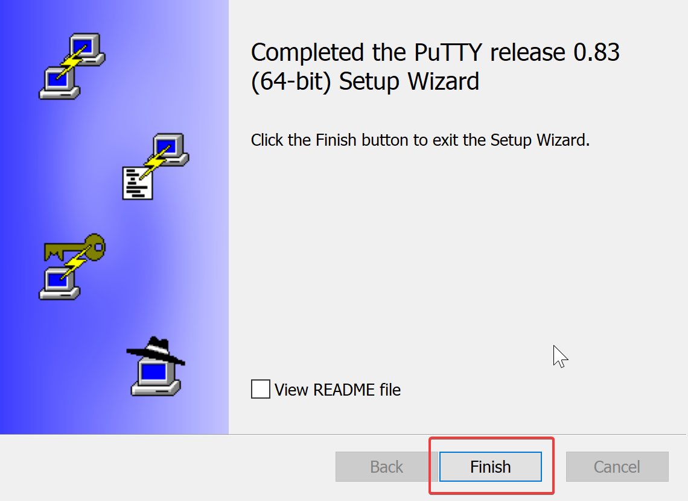
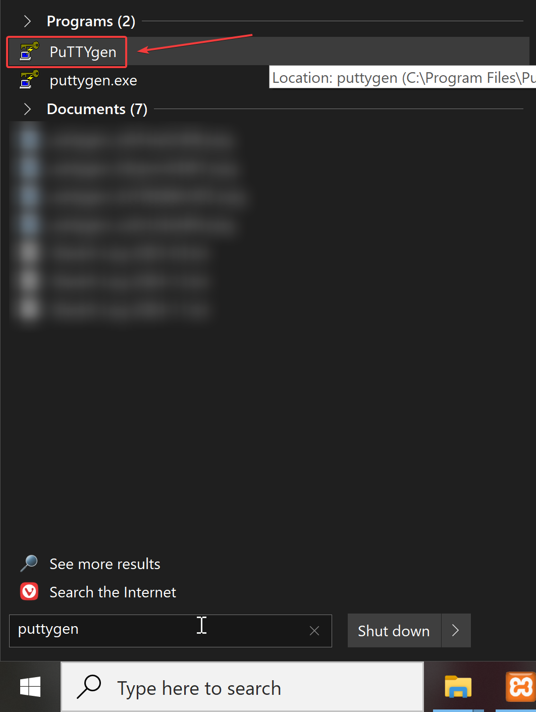
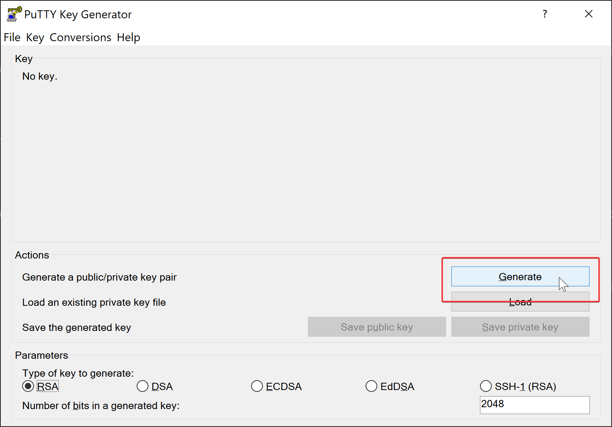
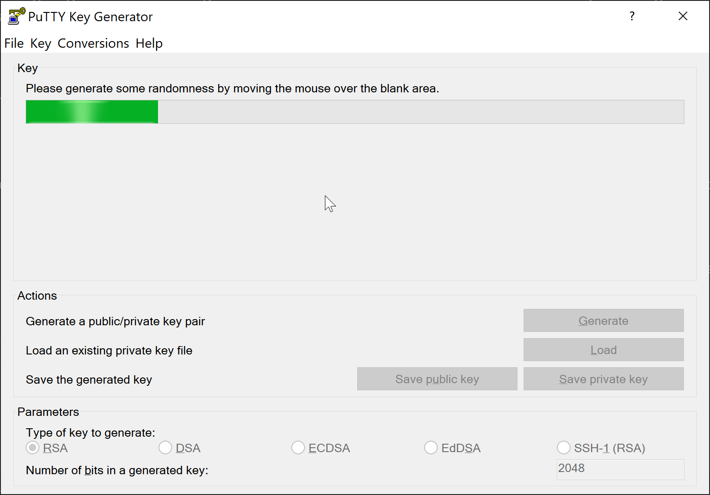
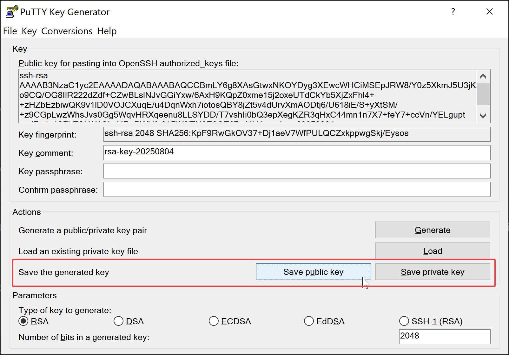
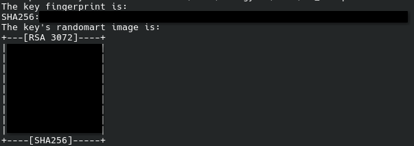

# SSH Client Setup

!!! example "WIP"

    Please include information here for Mac.

SSH (Secure Shell Protocol) is used to securely connect from your local computer to a remote server. It is required to interact with your live version of Lorekeeper and your private Github.

## Windows

For Windows, the preferred SSH client is PuTTY.

1. Go [here](https://www.chiark.greenend.org.uk/~sgtatham/putty/latest.html) to download PuTTY. Click the highlighted link to download it -- for most cases, you want the "64-bit x86" version.

<figure markdown="span">
  { width="600" }
</figure>

2. We're going to click through the screens to install PuTTY. Click "Next", leaving all settings as default, until you reach the "Install" button.

<figure markdown="span">
  { width="600" }
</figure>

3. After that's done, feel free to uncheck the README, and click "Finish".

<figure markdown="span">
  { width="600" }
</figure>

4. When you installed PuTTY, it also installs a software called PuTTYgen. Open up this software.

<figure markdown="span">
  { width="600" }
</figure>

5. It should look like this when opened. We are going to press the "Generate" button.

<figure markdown="span">
  { width="600" }
</figure>

6. Wiggle your mouse around as instructed!

<figure markdown="span">
  { width="600" }
</figure>

7. Save both your Public and Private key to somewhere safe on your computer. **The key is shown in this image for example's sake, but do not share your key publicly!** It's better to have people set up their own keys than to share yours.

<figure markdown="span">
  { width="600" }
</figure>

You have now configured your SSH client, move to [SSH complete](#ssh-setup-complete)!

## Mac

WIP

## Linux
Unlike Windows, linux is able to SSH from the command line and we do not need a client. We will still need a set of SSH keys however

1. Generate an SSH key in a terminal window:
: `ssh-keygen -t rsa`
: And follow the prompts to create your key. It should print something like this:
<figure markdown="span">
  { width="600" }
</figure>

## SSH Setup Complete
Congrats, you have now set up your SSH client and keys! Make sure you do not share these keys with ANYONE. If you wish to give access to additional people, they should generate their own set of keys to be added to the live server. You will need these keys when [configuring your live server](../setup-index.md#webserver-live-set-up) and [configuring your github remote](../setup-index.md#github-set-up).